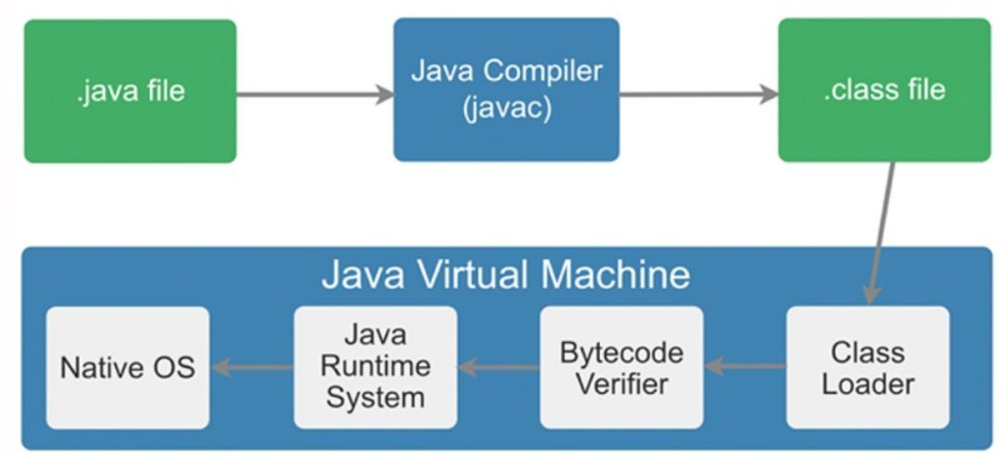
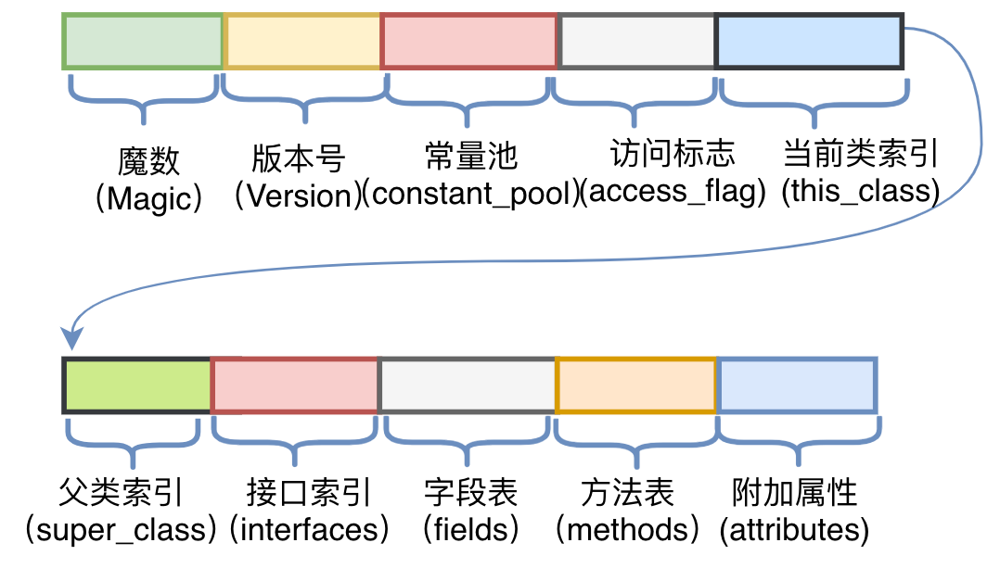
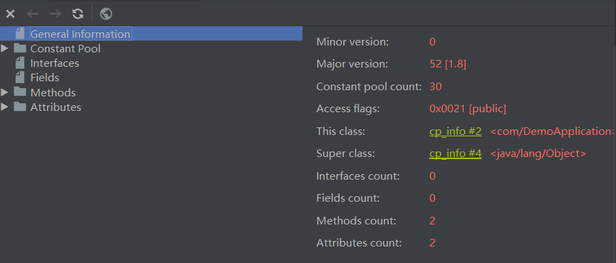
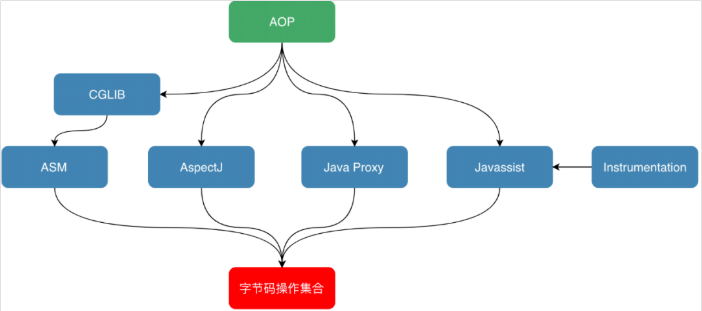
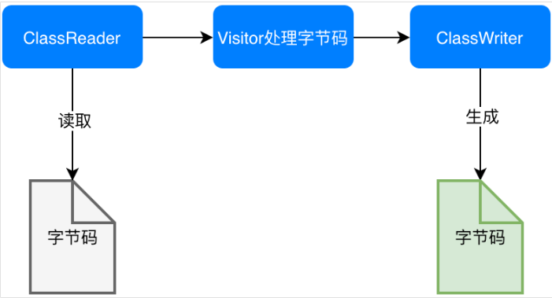
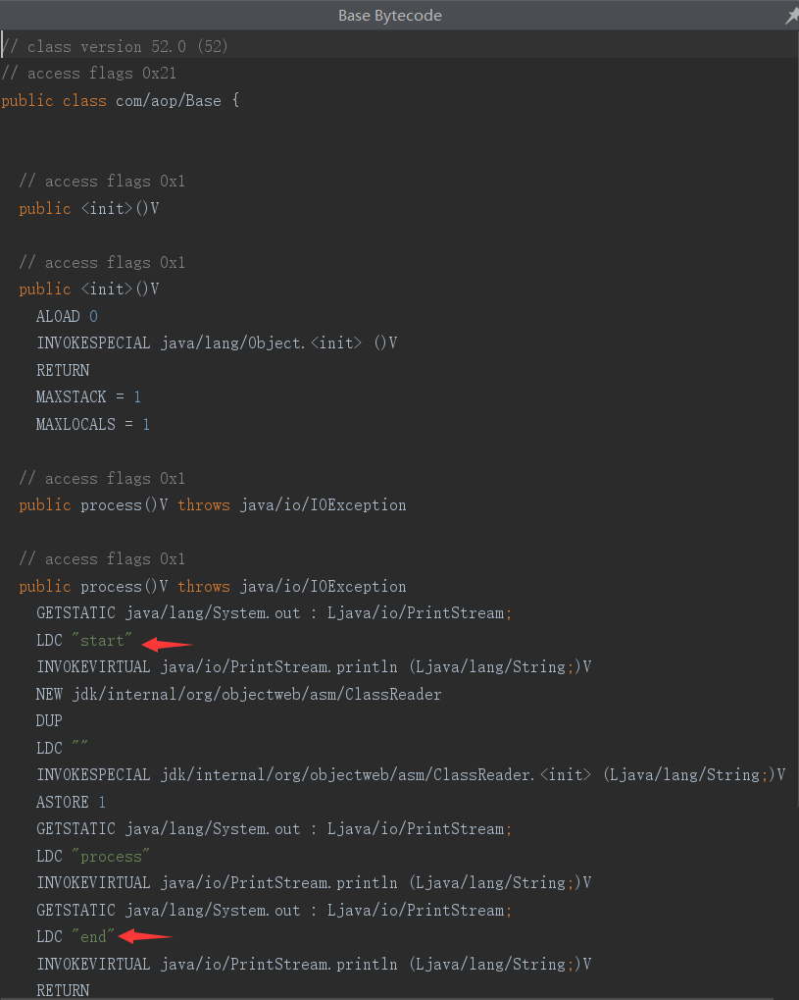
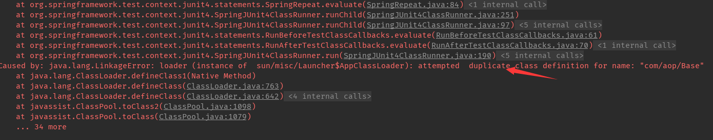

> 一直以来对字节码这块都特别陌生,所以打算对这块进行下整理,如果有错误的地方希望指正,参考的资料链接会放在文章下方

**开发环境:**<code>open-jdk-8</code>

**开发工具:**<code>idea</code>,<code>vim</code>

**系统环境:**<code>ubuntu18.04</code>

## 介绍
### 什么是字节码
java之所以可以“一次编译，到处运行”,一是因为对各类系统,平台进行了定制;二是无论在什么平台,都可以生成固定格式的字节码(.class)供虚拟机使用,(此处查询了网上资料:1字节 = 8位,16进制 = 2^4=4位,所以1字节 = 2个16进制位),而java虚拟机以两个十六进制位为一组



###  字节码结构
此处我们来测试下获取文件的字节码信息
HelloWorld.java
```java
public class HelloWorld {
	public static void main(String[] args) {
		System.out.pringln("hello");
	}
}
```
此处使用javac命令反编译,获取.class文件
```vb
$ vim HelloWorld.class
-- 然后通过:%!xxd转换为16进制获取字节码信息
```class
00000000: cafe babe 0000 0034 001d 0a00 0600 0f09  .......4........
00000010: 0010 0011 0800 120a 0013 0014 0700 1507  ................
00000020: 0016 0100 063c 696e 6974 3e01 0003 2829  .....<init>...()
00000030: 5601 0004 436f 6465 0100 0f4c 696e 654e  V...Code...LineN
00000040: 756d 6265 7254 6162 6c65 0100 046d 6169  umberTable...mai
00000050: 6e01 0016 285b 4c6a 6176 612f 6c61 6e67  n...([Ljava/lang
00000060: 2f53 7472 696e 673b 2956 0100 0a53 6f75  /String;)V...Sou
00000070: 7263 6546 696c 6501 000f 4865 6c6c 6f57  rceFile...HelloW
00000080: 6f72 6c64 2e6a 6176 610c 0007 0008 0700  orld.java.......
00000090: 170c 0018 0019 0100 0273 7307 001a 0c00  .........ss.....
000000a0: 1b00 1c01 000a 4865 6c6c 6f57 6f72 6c64  ......HelloWorld
000000b0: 0100 106a 6176 612f 6c61 6e67 2f4f 626a  ...java/lang/Obj
000000c0: 6563 7401 0010 6a61 7661 2f6c 616e 672f  ect...java/lang/
000000d0: 5379 7374 656d 0100 036f 7574 0100 154c  System...out...L
000000e0: 6a61 7661 2f69 6f2f 5072 696e 7453 7472  java/io/PrintStr
000000f0: 6561 6d3b 0100 136a 6176 612f 696f 2f50  eam;...java/io/P
00000100: 7269 6e74 5374 7265 616d 0100 0770 7269  rintStream...pri
00000110: 6e74 6c6e 0100 1528 4c6a 6176 612f 6c61  ntln...(Ljava/la
00000120: 6e67 2f53 7472 696e 673b 2956 0021 0005  ng/String;)V.!..
00000130: 0006 0000 0000 0002 0001 0007 0008 0001  ................
00000140: 0009 0000 001d 0001 0001 0000 0005 2ab7  ..............*.
00000150: 0001 b100 0000 0100 0a00 0000 0600 0100  ................
00000160: 0000 0100 0900 0b00 0c00 0100 0900 0000  ................
```
JVM规范要求每一个字节码文件都要由十部分按照固定的顺序组成,整体结构如图


此处内容过多就不具体讲解了,需要的小伙伴可以查询相关的资料,此处说下字节码的"彩蛋",
看过上方字节码的都会发现"cafe babe",有兴趣的可以测试下.

```vb
### 查看完整常量池
$ javap -verbose HelloWorld
```


### idea字节码查看插件
每次都使用javap特别麻烦,此处推荐idea插件:jclasslib(使用方法:View > Show Bytecode With jclasslib)


## 字节码增强
### 说明
字节码增强技术就是一类对现有字节码进行修改或者动态生成全新字节码文件的技术


### ASM
对于需要手动操纵字节码的需求,可以使用ASM,它可以直接生成.class字节码文件,也可以在类被加载入JVM之前动态修改类行为。ASM的应用场景有AOP(Cglib就是基于ASM),热部署,修改其他jar包中的类等。(建议对访问者模式有一定了解)
- ASM修改字节码


#### 核心API
ASM Core API类似XML文件中的SAX解析,不需要把这个类的整个结构读取进来，就可以用流式的方法来处理字节码文件,更加节约内存

CoreApi的几个核心类:

ClassReader：用于读取已经编译好的.class文件。
ClassWriter：用于重新构建编译后的类，如修改类名、属性以及方法，也可以生成新的类的字节码文件。
各种Visitor类：如上所述，CoreAPI根据字节码从上到下依次处理，对于字节码文件中不同的区域有不同的Visitor，比如用于访问方法的MethodVisitor、用于访问类变量的FieldVisitor、用于访问注解的AnnotationVisitor等。为了实现AOP，重点要使用的是MethodVisitor。

#### Asm Core Api调用流程
1.ASM 提供了一个类ClassReader可以方便地让我们对class文件进行读取与解析
2.ASM 在ClassReader解析class文件过程中，解析到某一个结构就会通知到ClassVisitor的相应方法(解析到类方法时，就会回调ClassVisitor.visitMethod方法)
3.可以通过更改ClassVisitor中相应结构方法返回值，实现对类的代码切入(更改ClassVisitor.visitMethod()方法的默认返回值MethodVisitor实例，通过操作该自定义MethodVisitor从而实现对原方法的改写)
4.其它的结构遍历也如同ClassVisitor；
5.通过ClassWriter的toByteArray()方法，得到class文件的字节码内容，最后通过文件流写入方式覆盖掉原先的内容，实现class文件的改写。

#### 树形API
ASM Tree API可以类比解析XML文件中的DOM方式，把整个类的结构读取到内存中，缺点是消耗内存多，但是编程比较简单。TreeAPI通过各种Node类来映射字节码的各个区域(类似于DOM)

#### 直接使用ASM模拟实现AOP
需求说明:(定义需要被增强的Base类：其中只包含一个process()方法，方法内输出一行“process”。增强后，我们期望的是，方法执行前输出“start”，之后输出"end"。)
Base.java
```java
public class Base {

    public void process()  {
        System.out.println("process");
    }
}
```
Generator.java
```java
/**
 * ClassWriter.COMPUTE_MAXS
 *      desc: A flag to automatically compute the maximum stack size and the maximum number of local variables of methods.
 *      translation: 一个用于自动计算最大堆栈大小和方法的局部变量最大数量的标志
 * ClassReader.SKIP_DEBUG
 *      desc: A flag to skip the SourceFile, SourceDebugExtension, LocalVariableTable, LocalVariableTypeTable and LineNumberTable attributes.
 *      translation: 跳过SourceFile，SourceDebugExtension，LocalVariableTable，LocalVariableTypeTable和LineNumberTable属性的标志
 */
public class Generator {

    public static void main(String[] args) throws IOException {
        //read
        ClassReader reader = new ClassReader("com.aop.Base");
        ClassWriter writer = new ClassWriter(ClassWriter.COMPUTE_MAXS);
        //handle
        ClassVisitor visitor = new MyClassVisitor(writer);
        reader.accept(visitor,ClassReader.SKIP_DEBUG);
        byte[] b = writer.toByteArray();
        File file = new File("target/test-classes/com/aop/Base.class");
        FileOutputStream out = new FileOutputStream(file);
        out.write(b);
        out.close();
        System.out.println("now generator cc success!!!!!");
    }
}
```
MyClassVisitor.java
```java
import org.objectweb.asm.ClassVisitor;
import org.objectweb.asm.MethodVisitor;
import org.objectweb.asm.Opcodes;

public class MyClassVisitor extends ClassVisitor implements Opcodes {
    public MyClassVisitor(ClassVisitor cv) {
        super(ASM5, cv);
    }
    @Override
    public void visit(int version, int access, String name, String signature,
                      String superName, String[] interfaces) {
        cv.visit(version, access, name, signature, superName, interfaces);
    }
    @Override
    public MethodVisitor visitMethod(int access, String name, String desc, String signature, String[] exceptions) {
        MethodVisitor mv = cv.visitMethod(access, name, desc, signature,
                exceptions);
        //Base类中有两个方法：无参构造以及process方法，这里不增强构造方法
        if (!name.equals("<init>") && mv != null) {
            mv = new MyMethodVisitor(mv);
        }
        return mv;
    }
    class MyMethodVisitor extends MethodVisitor implements Opcodes {
        public MyMethodVisitor(MethodVisitor mv) {
            super(Opcodes.ASM5, mv);
        }

        @Override
        public void visitCode() {
            super.visitCode();
            mv.visitFieldInsn(GETSTATIC, "java/lang/System", "out", "Ljava/io/PrintStream;");
            mv.visitLdcInsn("start");
            mv.visitMethodInsn(INVOKEVIRTUAL, "java/io/PrintStream", "println", "(Ljava/lang/String;)V", false);
        }
        @Override
        public void visitInsn(int opcode) {
            if ((opcode >= Opcodes.IRETURN && opcode <= Opcodes.RETURN)
                    || opcode == Opcodes.ATHROW) {
                //方法在返回之前，打印"end"
                mv.visitFieldInsn(GETSTATIC, "java/lang/System", "out", "Ljava/io/PrintStream;");
                mv.visitLdcInsn("end");
                mv.visitMethodInsn(INVOKEVIRTUAL, "java/io/PrintStream", "println", "(Ljava/lang/String;)V", false);
            }
            mv.visitInsn(opcode);
        }
    }
}
```

Base bytecode(直接查看是看不见的,需要安装反编译插件:Show Bytecode Outline;使用:在java文件右键>Show Bytecode Outline)



### Javassist
Javassist侧重在源代码层次,不同于Asm侧重在指令层次操作字节码(指令层次更加晦涩),其优点就在于编程简单。直接使用Java编码的形式，而不需要了解虚拟机指令，就能动态改变类的结构或者动态生成类

- CtClass（compile-time class）：编译时类信息，它是一个Class文件在代码中的抽象表现形式，可以通过一个类的全限定名来获取一个CtClass对象，用来表示这个类文件。
- ClassPool：从开发视角来看，ClassPool是一张保存CtClass信息的HashTable，Key为类名，Value为类名对应的CtClass对象。当我们需要对某个类进行修改时，就是通过pool.getCtClass("className")方法从pool中获取到相应的CtClass。
- CtMethod、CtField：对应的是类中的方法和属性。

#### 测试:
- pom.xml
```xml
<!-- https://mvnrepository.com/artifact/javassist/javassist -->
<dependency>
        <groupId>javassist</groupId>
        <artifactId>javassist</artifactId>
        <version>3.12.1.GA</version>
</dependency>
```
- JavassitTest.java
```java
@Test
public void testJavassit() throws NotFoundException, CannotCompileException, IOException, IllegalAccessException, InstantiationException {
        ClassPool pool = ClassPool.getDefault();
        CtClass cc = pool.get("com.aop.Base");
        CtMethod method = cc.getDeclaredMethod("process");
        method.insertBefore("{ System.out.println(\"start\");}");
        method.insertAfter("{ System.out.println(\"end\");}");
        Class c = cc.toClass();
        cc.writeFile("target/test-classes/");
        Base h = (Base)c.newInstance();
        h.process();
}
```

#### 问题
如果我们在一个JVM中，先加载了一个类，然后又对其进行字节码增强并重新加载会发生什么呢？例如在第一行加入Base b=new Base();由此可以看出JVM是不允许在运行时动态重载一个类的。如果我们想在一个持续运行并已经加载了所有类的JVM中，还能利用字节码增强技术对其中的类行为做替换并重新加载该如何让解决?


#### 解决方法
- 修改Base.java
```java
public class Base {

    public static void main(String[] args) {
        String name = ManagementFactory.getRuntimeMXBean().getName();
        String s = name.split("@")[0];
        System.out.println(s);
        while(true) {
            try {
                Thread.sleep(500);
            } catch (Exception e) {
                break;
            }
            process();
        }
    }

    public static void process() {
        System.out.println("process");
    }
}
```

- Instrument
> Instrument是JVM提供的一个可以修改已加载类的类库，专门为Java语言编写的插桩服务提供支持(在JDK 1.6以前，Instrument只能在JVM刚启动开始加载类时生效，而在JDK 1.6之后，Instrument支持了在运行时对类定义的修改)

资料参考:

- [以16进制的形式查看java class二进制文件](https://blog.csdn.net/u010889390/article/details/83658517) 
- [java字节码增强探秘](https://cloud.tencent.com/developer/article/1501753)
- [ASM Core Api 详解](https://www.jianshu.com/p/abd1b1b8d3f3)
- [ASM](https://asm.ow2.io/)
- [asmApi](https://docs.spring.io/spring/docs/current/javadoc-api/org/springframework/asm/)