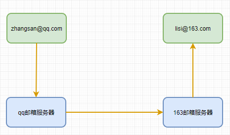
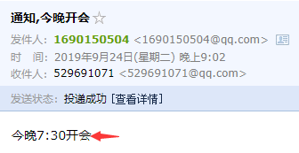

## 异步任务

### demo
在启动类上添加@EnableAsync:开启异步注解
controller

```java
@RestController
public class AsyncController {

    @Autowired
    AsyncService asyncService;

    @GetMapping("/hello")
    public String hello() {
        asyncService.hello();
        return "success";
    }
}
```
service
```java
@Service
public class AsyncService {

    @Async //告诉spring这是一个异步方法
    public void hello() {
        try {
            Thread.sleep(1000);
        } catch (Exception e) {
            e.printStackTrace();
        }
        System.out.println("处理数据中...");
    }
}
```
## 定时任务

| 字段 | 允许值             | 允许的特殊字符 |
| ---- | --------------------- | -------------- |
| 秒  | 0-59                  | ,-/*           |
| 分  | 0-59                  | ,-/*           |
| 小时 | 0-23                  | ,-/*           |
| 日期 | 1-31                  | ,-*?/LWC       |
| 月份 | 1-12                  | ,-/*           |
| 星期 | 0-7或SUN-SAT,0,7是SUN | ,-*?/LC#       |

---
| 特殊字符 | 代表含义               |
| -------- | -------------------------- |
| ,        | 枚举                     |
| -        | 区间                     |
| /        | 步长                     |
| *        | 任意                     |
| ?        | 日/星期冲突匹配    |
| L        | 最后                     |
| W        | 工作日                  |
| C        | 和Calendar联系后计算过的值 |
| #        | 星期  4#2:第2个星期四|

### demo
在启动类上添加@EnableScheduling//开启基于注解的定时任务
```java
/**
  * on the second as well as minute, hour, day of month, month and day of week.
  * such as {@code "0 * * * * MON-FRI"}:周一到周五每分钟0秒启动
  * [* * * * * MON-FRI] 周一到周五每秒执行一次
  * [0 0/5 14,18 * * ?] 每天14点整和18点整,每隔5分钟执行一次
  * [0 15 10 ? * 1-6] 每个月的周一至周六10:15分执行一次
  * [0 0 2 ? * 6L] 每个月的最后一个周六凌晨2点执行一次
  * [0 0 2 LW * ?] 每个月最后一个工作日凌晨2点执行一次
  * [0 0 2-4 ? * 1#1] 每个月的第一个周一凌晨2点到4点期间,每个整点执行一次
  */
@Scheduled(cron = "0/4 * * * * MON-FRI")
public void hello() {
    System.out.println("hello");
}
```

## 邮件任务

### starter引入

```xml
<dependency>
    <groupId>org.springframework.boot</groupId>
    <artifactId>spring-boot-starter-mail</artifactId>
</dependency>
```



```java
@ConfigurationProperties(prefix = "spring.mail")
public class MailProperties {

	private static final Charset DEFAULT_CHARSET = StandardCharsets.UTF_8;

	/**
	 * SMTP server host. For instance, `smtp.example.com`.
	 */
	private String host;

	/**
	 * SMTP server port.
	 */
	private Integer port;

	/**
	 * Login user of the SMTP server.
	 */
	private String username;

	/**
	 * Login password of the SMTP server.
	 */
	private String password;
    
	...
}
```

> 注意:想要使用qq邮箱需要开启POP3/IMAP/SMTP/Exchange/CardDAV/CalDAV服务,并获取授权码

application.yml

```yaml
spring:
  mail:
    username: 1690150504@qq.com
    ## 敏感信息就不显示了,此处不是qq密码,而是授权码
    password: ****
    host: smtp.qq.com
    properties:
      mail:
        smtp:
          ssl:
            enable: true
```

### 简单邮件发送

```java
@Autowired
JavaMailSenderImpl javaMailSenderImpl;

/**
 * 简单邮件发送
 */
@Test
public void contextLoads() {
    SimpleMailMessage message = new SimpleMailMessage();
    //邮件设置
    //邮件标题
    message.setSubject("通知,今晚开会");
    //邮件内容
    message.setText("今晚7:30开会");

    //收件人
    message.setTo("529691071@qq.com");
    //发件人
    message.setFrom("1690150504@qq.com");
    javaMailSenderImpl.send(message);
}
```

邮件发送成功:



### 复杂邮件发送

```java
/**
  * 带附件邮件发送
  */
@Test
public void sendWithFile() throws MessagingException {
    //创建一个复杂的消息邮件
    MimeMessage message = javaMailSenderImpl.createMimeMessage();
    //MimeMessage mimeMessage, boolean multipart
    MimeMessageHelper helper = new MimeMessageHelper(message, true);
    //邮件设置
    helper.setSubject("通知,今晚开会");
    //默认不开启html
    helper.setText("<b style='color:red'>今晚7:30开会</b>",true);
    helper.setTo("2712313163@qq.com");
    helper.setFrom("1690150504@qq.com");

    helper.addAttachment("1.jpg",new File("C:\\Users\\a1690\\AppData\\Roaming\\Typora\\typora-user-images\\1569326673463.png"));
    helper.addAttachment("2.jpg",new File("C:\\Users\\a1690\\AppData\\Roaming\\Typora\\typora-user-images\\1569330211331.png"));
    javaMailSenderImpl.send(message);
}
```


> 不过测试发现,这类邮件直接被加入了qq垃圾箱,囧

资料参考:
[cron表达式示例](https://linuxtools-rst.readthedocs.io/zh_CN/latest/tool/crontab.html)

[qq邮件客户端配置](https://service.mail.qq.com/cgi-bin/help?subtype=1&&id=28&&no=371)

[qq邮箱授权码获取](https://blog.csdn.net/qq_39818325/article/details/82890954)

