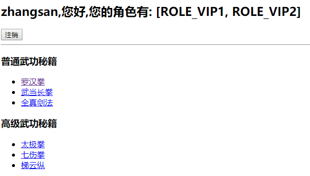

## Spring Boot与安全

> 这个是直接对教学视频做的整理,避免用到的时候又得到处搜索,视频来源(b站:https://www.bilibili.com/video/av38657363/?p=99)

测试项目请直接在此处下载基础代码进行测试:https://www.lanzous.com/i6ei0ve

### Spring Security

#### 引入maven

```xml
<!-- thymeleaf -->
<dependency>
	<groupId>org.springframework.boot</groupId>
	<artifactId>spring-boot-starter-thymeleaf</artifactId>
</dependency>
<!-- web -->
<dependency>
	<groupId>org.springframework.boot</groupId>
	<artifactId>spring-boot-starter-web</artifactId>
</dependency>
<!-- security -->
<dependency>
    <groupId>org.springframework.boot</groupId>
    <artifactId>spring-boot-starter-security</artifactId>
</dependency>
```

#### 编写Spring Security配置类

```java
@EnableWebSecurity
public class WebSecurityConfig extends WebSecurityConfigurerAdapter {

    /**
     * 控制请求权限
     * <em>
     * The most basic configuration defaults to automatically generating a login page at
     * the URL "/login", redirecting to "/login?error" for authentication failure.
     * </em>
     * <desc>
     * VIP1: 只能访问/level1/**
     * VIP2: 只能访问/level2/**
     * VIP3: 只能访问/level3/**
     * </desc>
     * @param http
     * @throws Exception
     */
    @Override
    protected void configure(HttpSecurity http) throws Exception {
        http.authorizeRequests()
                //定制请求的授权规则
                .antMatchers("/").permitAll()
                .antMatchers("/level1/**").hasRole("VIP1")
                .antMatchers("/level2/**").hasRole("VIP2")
                .antMatchers("/level3/**").hasRole("VIP3");
        //开启自动配置的登录功能,如果没有权限就进入登录页面(自带登录页面)
        http.formLogin();
        
        //开启自动配置的注销功能
        http.logout();
    }

    /**
     * 定义认证规则
     * @param auth
     * @throws Exception
     */
    @Override
    public void configure(AuthenticationManagerBuilder auth) throws Exception {
        //定义用户(此处只是测试,实际还是应该保存在数据库)
        auth.inMemoryAuthentication()
                .passwordEncoder(new BCryptPasswordEncoder())
                .withUser("zhangsan").password(new BCryptPasswordEncoder().encode("123")).roles("VIP1,VIP2")
                .and().withUser("lisi").password(new BCryptPasswordEncoder().encode("123")).roles("VIP2")
                .and().withUser("wangwu").password(new BCryptPasswordEncoder().encode("123")).roles("VIP3");
    }
}
```

##### 登录功能


##### 登出功能

```html
<!-- http.logout():The default is that accessing the URL * "/logout" will log the user out by invalidating the HTTP Session -->
<form th:action="@{/logout}" th:method="post">   <input type="submit" value="注销"></form>
```


##### 错误处理

> 解决方法:(passwordEncoder(new BCryptPasswordEncoder()))


> 需求说明: 当用户没有访问权限,信息对用户隐藏

#### 解决方案

##### 引入thymeleaf spring security支持

```xml
<dependency>
    <groupId>org.thymeleaf.extras</groupId>
    <artifactId>thymeleaf-extras-springsecurity5</artifactId>
</dependency>
```

##### 引入thymeleaf spring security名称空间

welocome.html:

```html
<html lang="es" xmlns="http://www.w3.org/1999/xhtml"
	  xmlns:th="http://www.thymeleaf.org"
	  xmlns:sec="http://www.thymeleaf.org/extras/spring-security">
```

##### 错误处理

> 开始根据视频一直出问题,后来在github issue里面找到了解决方法:
>
> address:https://github.com/thymeleaf/thymeleaf-extras-springsecurity/issues/61

```html
<!-- 未经过身份验证 -->
<div sec:authorize="!isAuthenticated()">
	<h2 align="center">游客您好，如果想查看武林秘籍 <a th:href="@{/login}">请登录</a></h2>
</div>
<!-- 经过身份验证 -->
<div sec:authorize="isAuthenticated()">
	<h2><span sec:authentication="name"></span>,您好,您的角色有:
		<span sec:authentication="principal.authorities"></span></h2>
	<form th:action="@{/logout}" th:method="post">
		<input type="submit" value="注销">
	</form>
</div>

<div sec:authorize="hasRole('VIP1')">
	<h3>普通武功秘籍</h3>
	<ul>
		<li><a th:href="@{/level1/1}">罗汉拳</a></li>
		<li><a th:href="@{/level1/2}">武当长拳</a></li>
		<li><a th:href="@{/level1/3}">全真剑法</a></li>
	</ul>
</div>

<div sec:authorize="hasRole('VIP2')">
	<h3>高级武功秘籍</h3>
	<ul>
		<li><a th:href="@{/level2/1}">太极拳</a></li>
		<li><a th:href="@{/level2/2}">七伤拳</a></li>
		<li><a th:href="@{/level2/3}">梯云纵</a></li>
	</ul>
</div>

<div sec:authorize="hasRole('VIP3')">
	<h3>绝世武功秘籍</h3>
	<ul>
		<li><a th:href="@{/level3/1}">葵花宝典</a></li>
		<li><a th:href="@{/level3/2}">龟派气功</a></li>
		<li><a th:href="@{/level3/3}">独孤九剑</a></li>
	</ul>
</div>
```

> 张三只有VIP1,VIP2权限,所以VIP3对其隐藏



##### 开启remember me功能

WebSecurityConfig.java

```java
//开启记住我功能
http.rememberMe();
```

> 有图片可以看出,开启后会出现remember me选项(实现原理:登录成功以后,携带此cookie,只要验证通过就会免登录)


##### 自定义登录页面

```java
http.formLogin().usernameParameter("user").passwordParameter("pwd").loginPage("/userlogin");
```

```html
<!-- 修改href为自定义login page requestmapping-->
<div sec:authorize="!isAuthenticated()">
	<h2 align="center">游客您好，如果想查看武林秘籍 <a th:href="@{/userlogin}">请登录</a></h2>
</div>
```

```java
<div align="center">
	<form th:action="@{/userlogin}" method="post">
		用户名:<input name="user"/><br>
		密码:<input name="pwd"><br/>
		<input type="submit" value="登陆">
	</form>
</div>
```

##### 自定义remember me

```java
http.rememberMe().rememberMeParameter("remember");
```

```html
<div align="center">
	<form th:action="@{/userlogin}" method="post">
		用户名:<input name="user"/><br>
		密码:<input name="pwd"><br/>
        <!-- 自定义remember me -->
		<input type="checkbox" name="remember">
		<input type="submit" value="登陆">
		</form>
</div>
```


资料参考:

[securing a web application](https://spring.io/guides/gs/securing-web/)