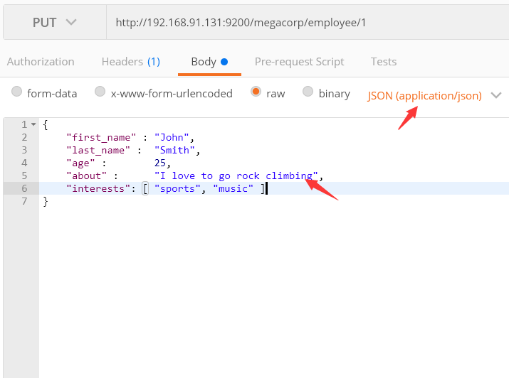
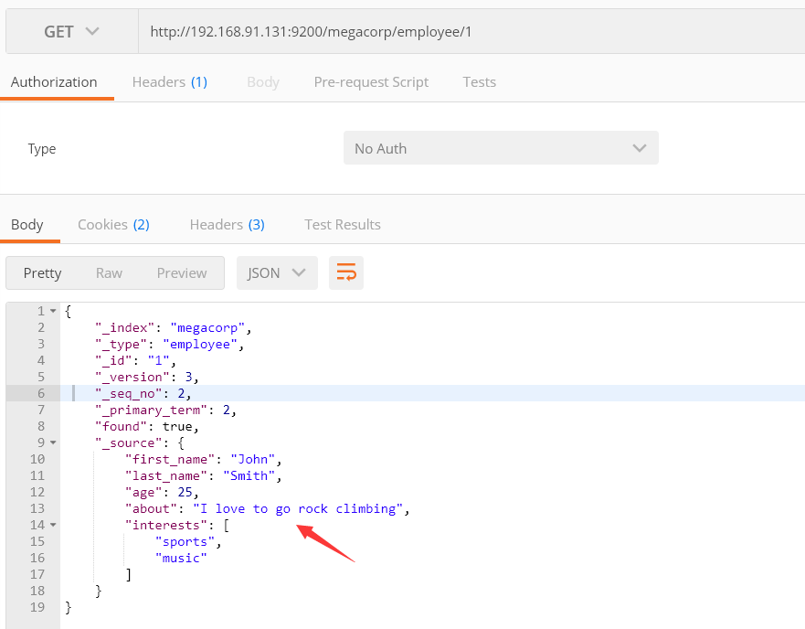
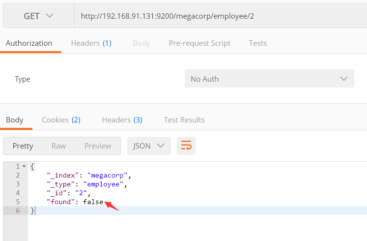
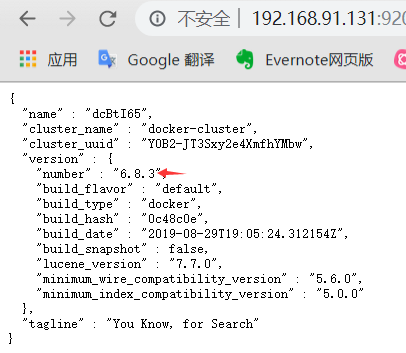
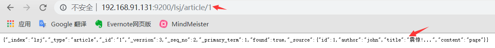
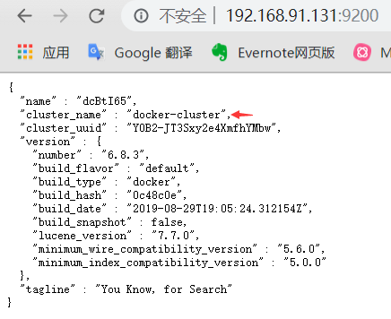
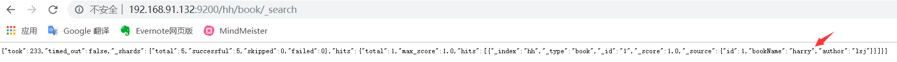

> ElasticSearch遵循restful风格;该文章只是elasticsearch入门不做详细阐述,详细信息请查看官方文档

## docker安装ElasticeSearch
```
## pull ElasticSearch
docker pull elasticsearch
## create network
docker network create somenetwork
## docker run
docker run -d --name elasticsearch --net somenetwork -p 9200:9200 -p 9300:9300 -e "discovery.type=single-node" elasticsearch:tag
```

## ElasticSearch测试
> 示例参考权威指南中文版:索引员工文档(此处使用postman来进行测试)。
DELEATE,HEAD请求有兴趣的朋友可以试下,这儿就不试一了


### PUT请求


---


### GET请求
数据存入后,我们再通过get请求来试着进行下查询

- 数据存在



- 数据不存在


## 查询所有员工信息
```
GET /megacorp/employee/_search
```


## 搜索姓名为smith的员工
```
## 使用轻量搜索进行查询
GET /megacorp/employee/_search?q=last_name:Smith
## 查询表达式进行查询
{
    "query" : {
        "match" : {
            "last_name" : "Smith"
        }
    }
}
```

## Spring Boot整合ElasticSearch
SpringBoot支持两种技术来实现与ES交互(1:Jest 2.SpringData ElasticSearch)

### Jest简单上手
从JestAutoConfiguration可以得知,如果使用Jest需要导入对应的包,版本需要和version保持一致

```xml
<dependency>
        <groupId>io.searchbox</groupId>
        <artifactId>jest</artifactId>
        <version>6.3.1</version>
 </dependency>
```
```java
@ConfigurationProperties(prefix = "spring.elasticsearch.jest")
public class JestProperties {

	/**
	 * Comma-separated list of the Elasticsearch instances to use.
	 * 默认:http://localhost:9200
	 */
	private List<String> uris = new ArrayList<>(Collections.singletonList("http://localhost:9200"));

	/**
	 * Login username.
	 */
	private String username;

	/**
	 * Login password.
	 */
	private String password;
	
	...
}
```
1. 配置yml
```yaml
spring:
  elasticsearch:
    jest:
      uris: http://192.168.91.131:9200
```
2. 创建article bean
```java
public class Article {
    @JestId
    private Integer id;
    private String author;
    private String title;
    private String content;
    ...
}
```
3. 测试类
```
@Autowired
JestClient jestClient;

@Test
public void contextLoads() throws IOException {
     //1.给Es索引(保存)一个文档
     Article article = new Article();
     article.setId(1);
     article.setAuthor("john");
     article.setTitle("震惊!...");
     article.setContent("page");

     //索引.类型.编号(类似:/megacorp/employee/1示例,此处已经在bean里面指定了id)
     Index index = new Index.Builder(article).index("lsj").type("article").build();
     jestClient.execute(index);
}
```
4. 发送请求进行测试


5. 测试搜索
```java
/**
 * 测试搜索
 */
@Test
public void search() throws IOException {
        String json = "{\n" +
                "    \"query\" : {\n" +
                "        \"match\" : {\n" +
                "            \"author\" : \"john\"\n" +
                "        }\n" +
                "    }\n" +
                "}";
        Search search = new Search.Builder(json).addIndex("lsj").addType("article").build();
        SearchResult result = jestClient.execute(search);
        //{"took":511,"timed_out":false,"_shards":{"total":5,"successful":5,"skipped":0,"failed":0},"hits":{"total":1,"max_score":0.2876821,"hits":[{"_index":"lsj","_type":"article","_id":"1","_score":0.2876821,"_source":{"id":1,"author":"john","title":"震惊!...","content":"page"}}]}}
        System.out.println(result.getJsonString());
}
```

### 简单上手SpringData ElasticSearch- 引入starter
1. 引入starter
```xml
<dependency>
        <groupId>org.springframework.boot</groupId>
        <artifactId>spring-boot-starter-data-elasticsearch</artifactId>
 </dependency>
```
2. 配置yml
```
spring:
  data:
    elasticsearch:
      cluster-name: docker-cluster
      cluster-nodes: 192.168.91.131:9300
```
cluster-name需要一致


3. 使用ElasticsearchRepository测试
```java
@Document(indexName = "lsj",type = "book")
public class Book {
    private Integer id;
    private String bookName;
    private String author;
    ...
}
```
```java
public interface BookRepository extends ElasticsearchRepository<Book,Integer> {

	/**
     * search by bookName
     * @param bookName
     * @return
     */
    List<Book> findByBookNameLike(String bookName);
}
```
```java
@Test
public void repository() {
     // 新增测试
     Book book = new Book();
     book.setAuthor("lsj");
     book.setBookName("harry");
     book.setId(1);
     bookRepository.index(book);
     
     //查询测试
     List<Book> result = bookRepository.findByBookNameLike("harry");
}
```


资料参考:
[docker:elasticsearch](https://www.elastic.co/guide/en/elasticsearch/reference/6.7/docker.html) 

[elasticsearch权威指南中文版](https://www.elastic.co/guide/cn/elasticsearch/guide/current/index.html) 

[springboot elasticsearch docs](https://docs.spring.io/spring-data/elasticsearch/docs/3.1.10.RELEASE/reference/html/)
