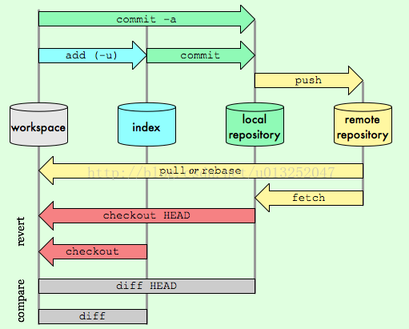
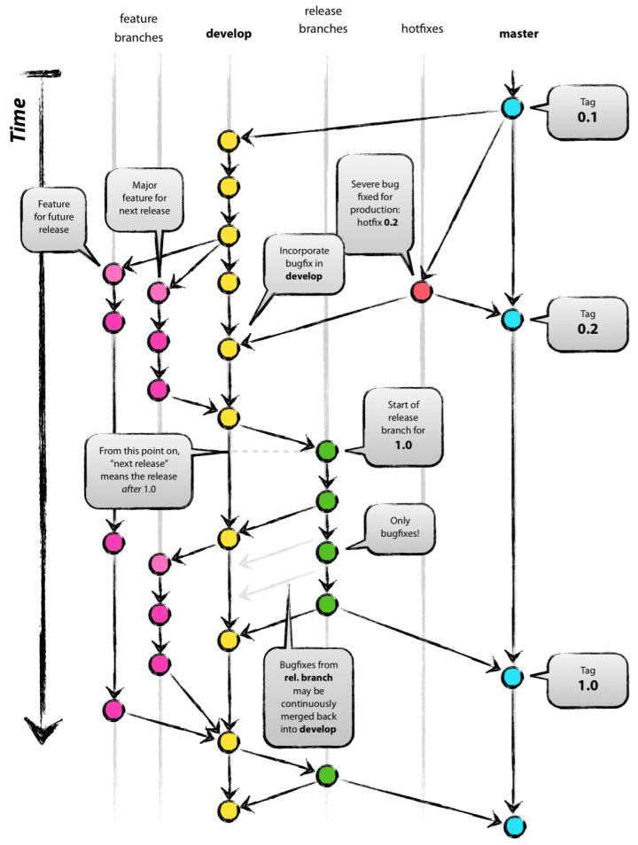
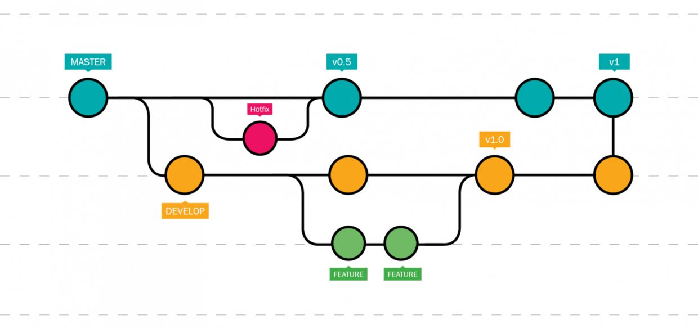
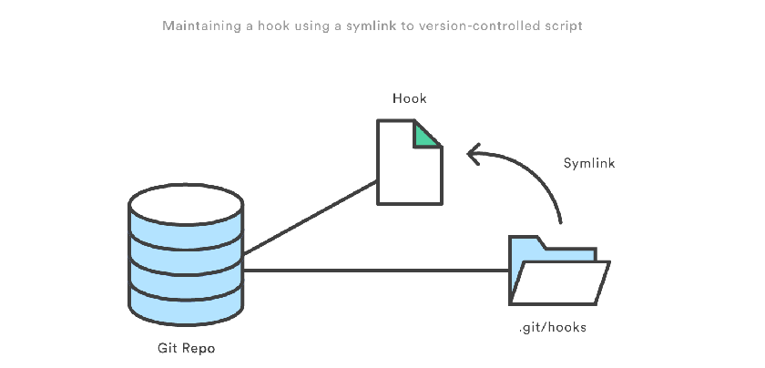
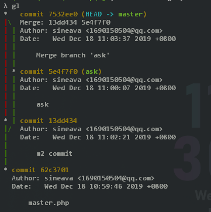
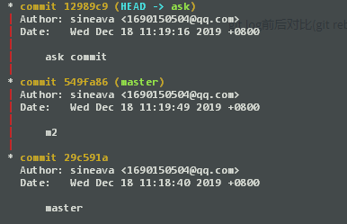

> 🐢以前对git只是一知半解,该篇文章结合视频对git进行深入理解

### 集中式与分布式

>集中式：SVN
>
>分布式：Git

#### 集中式

> 简单描述:
>
> 版本库是集中存放在中央服务器的，而干活的时候，用的都是自己的电脑，所以要先从中央服务器取得最新的版本，然后开始干活，干完活了，再把自己的活推送给中央服务器。
>
> 本地是没有版本库的修改记录的，所以集中式版本控制系统最大的毛病就是必须联网才能工作，如果在局域网内还好，带宽够大，速度够快，可如果在互联网上，遇到网速慢的话，可能提交一个10M的文件就需要5分钟。


#### 分布式

> 布式版本控制系统的安全性要高很多，因为每个人电脑里都有完整的版本库，某一个人的电脑坏掉了不要紧，随便从其他人那里复制一个就可以了。而集中式版本控制系统的中央服务器要是出了问题，所有人都没法干活了


### git工作区

工作区（workspace）
暂存区stage（index）
本地仓库（local repository）
远程仓库（remote repository



### git分支



**master** ：这个分支的代码是发布到生产的代码

**develop** ：这个分支的代码是预发布到生产的代码

**release** ：这个分支的代码是新版本发布到生产的代码

**feature** ：这个分支的代码是新需求开发的代码

**hotfix** ：这个分支的代码是紧急修复生产 bug 的代码

#### 分支策略



### git自动部署

> 当本地向github推送的时候,会触发github钩子,git hook向web服务器请求文件,执行git pull,拉取最新文件=> web服务器获取最新代码 => 因为侧重前端,所以这块需要的时候再了解



### git命令 

- 版本检查

  ```bash
  $ git --version
  ```

- 配置用户名与账号

  ```bash
  $ git config [--global] user.email "1690150504@qq.com"
  $ git config [--global] user.name "sineava"
  
  // 列举git配置
  $ git config --list
  ```

- 初始化版本库

  ```bash
  $ git init
  
  // 显示隐藏的文件夹与文件
  $ ls -a
  ```

- 克隆git项目

  ```bash
  $ git clone project_url
  ```

- 常规命令workflow=>项目提交

  ```bash
  $ touch readme.md
  $ git add .
  $ git commit -m "msg"
  ```

- 状态查看

  ```bash
  $ git status
  // Untracked files => 等待提交到暂存区(未add)
  // Changes not staged for commit => 版本已有文件遭到修改但是还没提交到暂存区
  // Changes to be committed => 已提交到暂存区
  ```

- 文件忽略提交

  ```bash
  $ touch .gitignore
  
  .gitignore配置:
  *.txt 	// 根据后缀忽略
  a.txt 	// 忽略a.txt
  !a.txt 	// 忽略非a.txt
  
  // => 注意: git项目文件夹里面没有文件不会进行跟踪
  /dist 				// 忽略dist文件夹
  /dist/index.html 	// 忽略dist下的index.html
  ```

- 删除文件

  ```bash
  $ git rm a.txt 			=> 从版本库删除a.txt(本地也会消失)
  $ git rm --cached a.txt => 从版本库撤销(暂存区消失,本地不会)
  ```

- 查看日志

  ```bash
  $ git log 				// 查看commit提交日志
  $ git log -p 			// 查看文件提交变动日志
  $ git log -p -1 		// 查看最近一次提交日志
  $ git log --online		// 查看简短日志
  $ git log --name-only	// 查看文件发生变化日志
  $ git log --name-status	// 查看文件发生了何种变化日志(删除/增加)
  $ git log -p -2 --online --name-only --name-status // 常规命令
  ...
  
  // 变动信息说明
  + 在文件中添加了一行
  - 从文件中删除了一行
  ```

- git已commit情况下修改文件名=>适用于出现文件改名,版本库不发生变化

  ```bash
  $ git mv Index.html index.html
  ```

- git提交

  ```bash
  $ git commit -m "客户是傻逼"
  $ git commit --amend => 修改“客户是傻逼” => "客户真帅"(不会留下记录)
  
  ## git commit --amend编辑器报错解决=>修改默认编辑器为vim
  git config --global core.editor vim
  ```

- 撤销提交

  ```bash
  $ git reset HEAD readme.md 	// 从仓库回退到工作区
  $ git checkout -- hi.php 	// 从暂存区回退到工作区
  ```

- 修改git别名

  ```bash
  $ git config [--global] alias.a add => add别名改为a=>使用的git配置
  
  // 系统修改别名参考文末资料
  ```

- 分支

  ```bash
  $ git branch				// 查看分支
  $ git branch -a				// 查看分支(包括远程分支)
  $ git push --set-upstream origin ask // 将分支推送到远程服务器(远程服务器不存在当前分支)
  
  $ git branch login 			// 创建login分支
  $ git checkout login 		// 切换当前分支到login分支
  
  $ git checkout -b register 	// 创建register,并切换当前分支到register分支
  
  $ git checkout master
  $ git merge login 			// 合并login分支到master分支
  // 当前分支合并到另一分支时，如果没有分歧解决，就会直接移动文件指针(这个过程叫做fastforward)
  
  $ git branch -d login 		// 删除login分支(未合并分支是删除不了的)
  $ git branch -D bbs			// 强制删除未合并分支(慎重使用=>如果未提交,就找不回来了^_^)
  $ git push origin --delete ask // 删除远程分支
  
  $ git branch --merged		// 查看已经合并的分支(如何直接在master分支上创建分支且未发生修改
  							,基于master分支,等同于合并)
  $ git branch --no-merged    // 查看未合并分支
  ```

- 分支冲突解决

  ```bash
  // 分支冲突产生原因: 在多个分支上对同一文件进行了修改并且进行了提交,主分支合并时产生冲突
  
  // 分支冲突模拟
  $ git init
  $ touch readme.md
  $ vim readme.md 					// 修改文件
  $ git add .
  $ git commit -m "master commit" 	// 在master分支进行提交
  // 开始分支冲突模拟
  $ git checkout -b login
  $ git checkout -b register
  $ vim readme.md 					// register分支修改文件
  $ git add .
  $ git commit -m "register commit" 	// 在register分支进行提交
  $ git checkout login
  $ vim readme.md 					// login分支修改文件
  $ git add .
  $ git commit -m "login commit" 		// 在login分支进行提交
  $ git checkout master
  $ git merge register
  $ git merge login => 此时冲突产生
  // CONFLICT (content): Merge conflict in readme.md
  Automatic merge failed; fix conflicts and then commit the result.
  
  // 必须人为解决: => 手动选择哪块代码,重新提交
  
  第一次提交 => 所有分支共有数据
  <<<<<<< HEAD
  第二次提交 // <<<<<<<到=======区域,当前HEAD指针在master,所以当前是master分支内容
  第三次提交 
  =======
  第四次提交 // =======到>>>>>>>区域为login分支内容
  >>>>>>> login => login分支内容
  ```

- stash临时储存区

  > 适用场景: 当前分支做到一半(此时不适合提交,也不适合删除分支),不想放弃当前分支,但是临时有其他功能需要开发
  >
  > 如果直接切换,报错如下
  >
  > error: Your local changes to the following files would be overwritten by checkout:
  >         register.html
  > Please commit your changes or stash them before you switch branches.
  > Aborting

  ```bash
  $ git stash					// 将当前的工作状态保存到git栈
  $ git stash list 			// 查看stash列表
  
  $ git stash apply			// 当其他分支操作完成后,恢复临时储存区,继续当前分支开发 => 临时储存区依然存在
  $ git stash drop stash@{0}	// 删除临时储存区(0=>表示第0个...) => 此时git stash list就查询不到了
  ```

- git标签

  > 注意: 标签不要随便打,稳定版才打上标签

  ```bash
  git tag 		// 查看当前标签
  git tag v1.0.0	// 打上v1.0.0标签 => 可以打上多个标签
  ```

- 发布压缩包

  ```bash
  $ git archive master --prefix="稳定版app" --form=zip > app.zip // 此时会多出app.zip
  ```

-  git rebase

  > **公共分支禁止使用rebase**
  >
  > 场景一:  develop分支进行了提交,接着master分支进行了提交,此时master分支限于develop分支,此时Merge会混乱git commit记录

  ```bash
  // 模拟环境
  $ git init
  $ touch master.html
  $ git add .
  $ git commit -m "master"
  $ git checkout -b ask
  $ touch ask.html
  $ git add .
  $ git commit -m "ask"
  $ git checkout master
  $ touch m2.php
  $ git add .
  $ git commit -m "master m2"
  // 如果此时git merge ask分支,就会出现图一的git log(较混乱) => 此时master分支比ask分支提前
  
  // git rebase
  $ git checkout ask
  $ git rebase master
  // 此时git commit记录更为干净=>子分支的基础点移到主分支后边
  ```

  

  git log前后对比(git rebase后提交记录更加清晰)

  

  

- ssh/https连接

  >对比: ssh连接可以进行无密码连接,但是需要配置密钥
  >
  >=> 不同于https连接,不需要git remote add origin master操作,会直接进行配置

  ```bash
  // 密钥配置
  $ cd ~/.ssh
  $ vim id_rsa.pub // 复制公钥内容=>粘贴到github>setting>ssh and gpg keys>new ssh key
  
  // ssh情况下推送(初次)
  $ git clone git@github.com:sineava/git-release.git 
  $ touch readme.md
  $ git add .
  $ git commit -m "docs readme.md"
  $ git push // 省去配置
  ```

- 远程仓库

  ```bash
  // 本地版本库主动进行远程关联(初次)
  $ git remote add origin git@github.com:sineava/git-release.git
  $ git push -u origin master // 推送到远程服务器master分支
  
  // 查看远程仓库
  git remote -v
  ```

- git常规操作

  ```bash
  $ git clone https://github.com/sineava/git-release.git test => 将项目clone到test目录
  $ git branch -a
  $ git pull origin ask:ask // 将远程ask分支pull到本地,形成ask分支
  $ git push --set-upstream origin ask
  ```

  

---

参考资料

[git下载-macos/liux/window](https://git-scm.com/download)

[廖雪峰-集中式vs分布式](https://www.liaoxuefeng.com/wiki/896043488029600/896202780297248)

[后盾人-git视频教程](https://www.bilibili.com/video/av56582999?from=search&seid=8645296339130960606)

[win10 git bash 设置别名](https://blog.csdn.net/geol200709/article/details/96335072)

[彻底搞懂git rebase](http://jartto.wang/2018/12/11/git-rebase/)

[git hook实现自动化部署](https://blog.csdn.net/weixin_34128534/article/details/88748810)