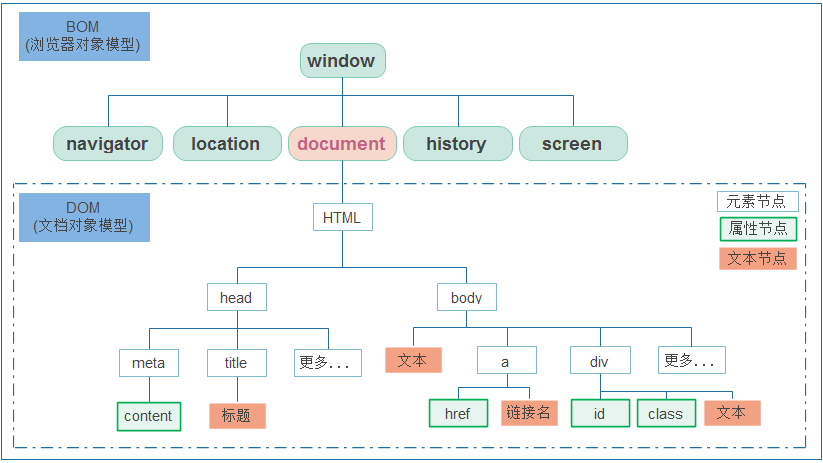
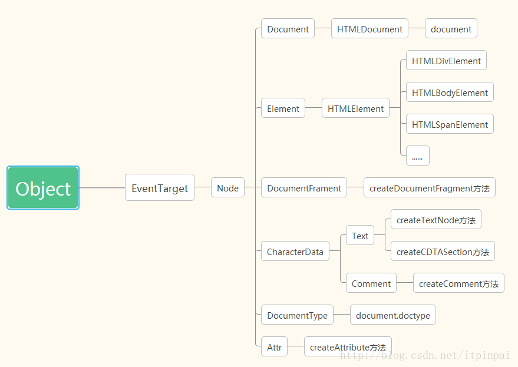
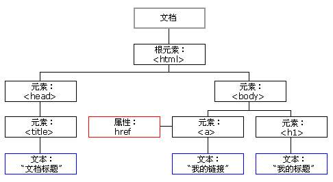
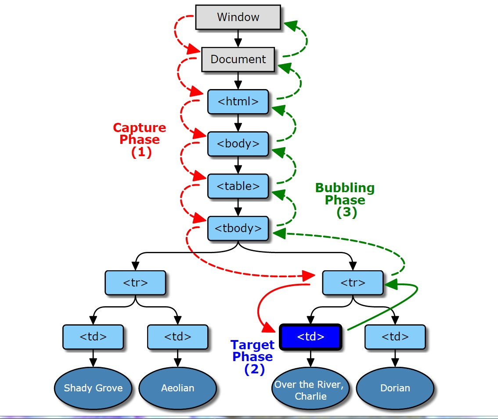

# DOM与BOM

> javascript提供了系列api用于操作bom,dom,更多api搜索mdn相关文档

## 定义

- DOM
  - 文档对象模型(Document Object Model),对html文档页面进行编程控制的系列API接口
  - 提供对文档的结构化描述,定义方式对结构进行访问并进行修改结构,样式和内容

- Bom
  - 浏览器对象模型(Browser Object Model)
  - 提供系列与浏览器相关api
- Bom+Dom结构

 

- Dom继承关系图

  

## Dom

### dom树



- 文档: 一个页面就是一个文档,DOM中使用document表示
- 元素: 页面中的所有标签都是元素,DOM中使用element表示
- 节点: 网页中的所有内容都是节点(标签,属性,文本,注释等),DOM中使用node表示

### document对象

> document对象对应整个文档,整个文档相关的操作和编程的api都是通过document对象进行实现

- 常用属性

  - URL: 获取当前文档的URL地址,只读

    ```js
    document.URL
    ```

  - title: 获取当前文档Head中的title的文字内容,可写入修改

    ```js
    document.title
    ```

- dom树相关操作
  - getElementById(id) 											=> 根据id,返回Element✅
  - getElementsByTagName(tageName)        => 根据标签名(如果是*,返回所有),返回HTMLCollection集合
  - getElementsByName(name)                      => 根据name属性,返回NodeList集合
  - querySelector(selectors)                            => 根据css选择器✅
  - querySelectorAll(selectors)                        => 根据css选择器✅,多个选择器以逗号分隔querySelectorAll( 'p,a') 

- 获取body,html

  ```js
  // 获取body元素
  const bodyElem = document.body;
  // 获取Html元素
  const htmlElem = document.documentElement;
  ```

### 时钟操作

- setInterval(重复执行,每次调用有时间延迟)

  ```js
  let inervalId = setInterval(code, milliseconds);
  let inervalId = setInterval(function, milliseconds, param1, param2, ...)
  ```

- setTimeOut(只执行一次,延迟delay毫秒后执行)

  ```js
  let interValId = setTimeOut(fn,delay)
  ```

- 清除延迟

  ```js
  clearInterVal(inervalId)	 // 对应setInterval
  clearTimeOut(inervalId)		 // 对应setTimeOut
  ```

- 标题跑马灯效果实现

  ```js
  // 数组方式实现跑马灯效果
  setInterval(() => {
      let title = [...document.title];
      title.unshift(title.pop());
      document.title = title.join('');
  }, 500);
  
  // 字符串方式实现跑马灯
  setInterval(() => {
      let oldTitle = document.title;
      let newTitle = oldTitle.slice(-1).concat(oldTitle.slice(0, -1));
      document.title = newTitle;
  }, 500);
  ```

### 元素对象

- Element

  ```js
  // Element对象是所有标签元素的基础对象,封装了所有标签元素的公共方法与属性
  // 常用属性
  Element.attributes						// 获得所有属性key-value集合
  Element.className						// 获得类名(可读写)=>idea:elem.className = 'pink',然后再css定义
  										// 注意:此方法会覆盖原有类名
  Element.id								// 获取元素id
  Element.innerHTML						// 获取元素内部包裹的html标签字符串(可读写)
  Element.innerText						// 获取元素内部文本,标签不识别会直接进行显示(可读写)
  Element.tagName							// (只读)获取元素的标签名字符串
  Element.style							// 获取/修改style样式,如Element.style.backgroundColor
  // 常用方法
  Element.getAttribute(attrName)			// 返回属性的字符串值,适合获取自定义属性data-
  Element.removeAttribute(attrName)		// 从指定的元素中删除一个属性
  Element.setAttribute(attrName,value)	// 设置属性
  Element.hasAttribute(attrName)			// 检测属性是否存在
  Element.getElementsByClassName()		// 获取后代元素根据className
  Element.getElementsByTagName()			// 获取后代元素根据tagName
  ...
  
  Element.dataset.index | Element.dataset['index']  // 用于获取data-自定义属性(h5新增),支持驼峰命名获取(ie11+)
  ```

- HTMLCollection

  ```js
  // HTMLCollection对象,是伪数组。元素的动态集合,提供了用来从该集合选择元素的方法和属性,当其所包含的文档结构发生改变时,会自动更新.
  // 常用属性
  HTMLCollection.length 		// 返回集合中子元素的数组
  // 常用方法
  HTMLCollection.item()		// 根据给定的索引（从0开始），返回具体的节点
  HTMLCollection.namedItem() 	// 根据 Id 返回指定节点，或者作为备用，根据字符串所表示的 name 属性来匹配
  ```
  

### 节点操作

> 一般的,节点至少拥有nodeType(节点类型),nodeName(节点名称),nodeValue(节点值)

- 元素节点 nodeType为1
- 属性节点 nodeType为2
- 文本节点 nodeType为3(文本几点包含文字,空格,换行等)

#### 节点层级

- 父级节点

  ```js
  node.parentNode // 找不到返回null
  ```

- 子节点

  ```js
  parentNode.childNodes 			// 注意: 会返回3种子节点=>如果指向某种节点,可通过nodeType判断
  parentNode.firstChild			// 返回第一个子节点(会包括3种节点)
  parentNode.lastChild			// 获取最后一个子节点(会包括3种节点)
  
  parentNode.children				// 只获取子元素节点
  parentNode.firstElementChild	// 获取第一个子元素节点(ie9+)
  parentNode.lastElementChild		// 获取最后一个子元素节点(ie9+)
  ```

- 兄弟节点

  ```js
  node.nextSibling				// 当前元素的下一个兄弟节点(会包含3种节点)
  node.previousSibling			// 当前元素的上一个兄弟节点(会包含3种节点)
  
  node.nextElementSibling			// 当前元素的下一个兄弟元素节点(ie9+)
  node.previousElementSibling		// 当前元素的上一个兄弟元素节点(ie9+)
  ```

- 节点创建与添加

  ```js
  // 创建节点
  let li = document.createElement('li');
  // 在已有子节点后面追加节点(不会覆盖原有节点)
  parentNode.appendChild(li);
  // 在指定子节点前面追加节点(不会覆盖原有节点)
  parentNode.insertBefore(child,指定子元素)
  ```

- 节点移除

  ```js
  parentNode.removeChild(child节点)		// 删除父元素的某个子节点
  ```

- 节点复制

  ```js
  node.cloneNode()	// 拷贝node节点=>浅拷贝,只拷贝标签,不拷贝里面内容
  node.cloneNode(true)// 拷贝node节点=>深度拷贝,拷贝标签以及里面内容
  ```

  

### 事件

- 绑定方式

  - 直接在html中给标签添加事件属性

    ```html
    <p onclick="alert(123)">
      点击  
    </p>
    ```

  - 通过js代码绑定元素添加事件属性

    ```js
    const elem = document.querySelector('p')
    elem.onclick = function() {
        alert('点击段落');
    }
    ```

- 事件流

  >事件分为捕获阶段与冒泡阶段.捕获阶段就是事件信息从顶层向下层传递的过程,冒泡时事件反应处理从底层向上层反馈的过程。
  >
  >js可以通过addEventListener来实现捕获阶段或者冒泡阶段的事件响应方法注册

​		

- 事件绑定与绑定解除

  ```js
  // true:事件句柄在捕获阶段执行 false(默认):事件句柄在冒泡阶段执行
  // 注意:解除绑定与绑定的事件内存地址需要相同
  let div = document.getElementById('div')
  function listener(event) {
      
  }
  div.addEventListener('click',listener,true)
  div.removeEventListener('click',listener,true)
  ```


## 案例

- 同一组元素,点击某个元素修改背景色,其他还原

  ```css
  * {
      margin: 0;
      padding: 0;
      box-sizing: border-box;
  }
  ```

  ```html
  <ul>
      <li>按钮1</li>
      <li>按钮2</li>
      <li>按钮3</li>
      <li>按钮4</li>
      <li>按钮5</li>
  </ul>
  
  <script>
      // 排他算法实现点击修改背景色
      const lis = document.querySelectorAll('ul>li');
      [...lis].map((elem, index) => {
          elem.addEventListener('click', function() {
              const otherElem = document.querySelectorAll(`ul>li:not(:nth-child(${index + 1}))`);
              [...otherElem].map(item => {
                  item.style.backgroundColor = '';
              });
              elem.style.backgroundColor = 'red';
          });
      });
  </script>
  ```

- 点击换肤

  ```css
  * {
      margin: 0;
      padding: 0;
      box-sizing: border-box;
  }
  body {
      width: 100%;
      height: 100vh;
      background-size: cover;
  }
  main {
      width: 100vw;
      height: 50vh;
      display: flex;
      justify-content: center;
      align-items: center;
  }
  section {
      width: 200px;
      height: 130px;
      border: 1px solid #ddd;
      overflow: hidden;
  }
  section img {
      width: 100%;
  }
```
  
  ```html
  <main>
      <section>
          
      </section>
      <section>
          
      </section>
      <section>
          
      </section>
      <section>
          
      </section>
  </main>
  
  <script>
      const imgs = document.querySelectorAll('section>img');
      [...imgs].map(elem => {
          elem.addEventListener('click', function() {
              document.body.style.background = `url(${this.src}) no-repeat`;
              // 注意:如果通过js操作,background-size写在css里面无效
              document.body.style.backgroundSize = 'cover';
          });
      });
  </script>
  ```
  
- 表格隔行换色与全选反选

  ```css
  * {
      margin: 0;
      padding: 0;
      box-sizing: border-box;
  }
  table {
      text-align: center;
      margin: 100px auto;
  }
  td {
      vertical-align: middle;
      width: 200px;
      padding: 5px 10px;
  }
  .gray {
      background-color: #dfe6e9;
  }
  .deep {
      background-color: #636e72;
      color: white;
  }
  thead tr:nth-of-type(1) {
      background-color: #a29bfe;
  }
  [type='checkbox'] {
      width: 15px;
      height: 15px;
  }
  ```

  ```html
  <table>
      <thead>
          <tr>
              <td><input class="ckAll" type="checkbox" /></td>
              <td>ID</td>
              <td>NAME</td>
              <td>AGE</td>
              <td>ADDRESS</td>
          </tr>
      </thead>
      <tbody></tbody>
  </table>
  
  <script>
      class CheckBox {
          static listenOtherAllStatus() {
              let status = '';
              [...ckOther].map((elem, index) => {
                  if (index == 0) {
                      status = elem.checked;
                      return;
                  }
                  if (elem.checked != status) {
                      status = false;
                  }
              });
              ckAll.checked = status;
          }
          static handleCkAll(flag = false) {
              flag = ckAll.checked ? true : false;
              [...ckOther].map(elem => {
                  elem.checked = flag;
              });
          }
      }
  
      const data = [
          { id: 1, name: '张三', age: 21, address: '北京市朝阳区' },
          { id: 2, name: '李四', age: 22, address: '重庆市大渡口区' },
          { id: 3, name: '王五', age: 18, address: '四川省青羊区' }
      ];
      const tbodyElem = document.querySelector('tbody');
      let elem = '';
      data.map((item, index) => {
          elem += `<tr class='${
          index % 2 == 0 ? 'gray' : 'deep'
      }'><td><input type="checkbox" /></td><td>${item.id}</td><td>${
          item.name
      }</td><td>${item.age}</td><td>${item.address}</td></tr>`;
      });
      tbodyElem.innerHTML = elem;
      const ckAll = document.querySelector('.ckAll');
      const ckOther = document.querySelectorAll(
          'tbody [type="checkbox"]'
      );
      ckAll.addEventListener('click', CheckBox.handleCkAll);
      [...ckOther].map(elem => {
          elem.addEventListener('click', CheckBox.listenOtherAllStatus);
      });
  </script>
  ```

- tab栏切换

  ```css
  * {
      margin: 0;
      padding: 0;
  }
  header {
      width: auto;
      display: flex;
  }
  header > section {
      display: block;
      padding: 18px;
  }
  ```

  ```html
  <div class="container">
      <header>
          <section>商品介绍</section>
          <section>规格与包装</section>
          <section>售后保障</section>
          <section>商品评价</section>
      </header>
      <article></article>
  </div>
  
  <script>
      const sectionElem = document.querySelectorAll('header > section');
      const articleElem = document.querySelector('article');
      [...sectionElem].map(elem => {
          elem.addEventListener('click', function() {
              [...sectionElem].map(item => {
                  item.style.backgroundColor = '';
                  item.style.color = '';
              });
              this.style.backgroundColor = '#e74c3c';
              this.style.color = 'white';
              articleElem.innerHTML = `<span>${this.innerText}</span>`;
          });
      });
  </script>
  ```

- 下拉菜单

  ```css
  * {
      margin: 0;
      padding: 0;
      box-sizing: border-box;
  }
  .bar {
      display: flex;
  }
  .bar > li {
      list-style: none;
      position: relative;
  }
  .bar > li > a {
      display: block;
      padding: 10px 40px;
  }
  .bar > li:hover {
      background-color: #1dd1a1;
  }
  a + ul {
      width: 100%;
      margin-top: 10px;
      position: absolute;
      display: none;
      text-align: center;
  }
  a + ul > li {
      list-style: none;
  }
  ```

  ```html
  <header>
      <ul class="bar">
          <li>
              <a>微博</a>
              <ul>
                  <li>私信</li>
                  <li>评论</li>
                  <li>@我</li>
              </ul>
          </li>
          <li>
              <a>博客</a>
              <ul>
                  <li>明日之后</li>
                  <li>肝帝</li>
              </ul>
          </li>
          <li>
              <a>邮箱</a>
              <ul>
                  <li>qq邮箱</li>
                  <li>gmail邮箱</li>
              </ul>
          </li>
      </ul>
  </header>
  
  <script>
      const elem = document.querySelectorAll('a');
      [...elem].map(item => {
          item.addEventListener('mouseover', function() {
              const friendElem = this.parentNode.children[1];
              friendElem.style.display = 'block';
          });
          item.addEventListener('mouseout', function() {
              const friendElem = this.parentNode.children[1];
              friendElem.style.display = 'none';
          });
      });
  </script>
  ```

  

  

---

参考资料

[mdn web apis](https://developer.mozilla.org/zh-CN/docs/Web/API)

[mdn-DOM standard](https://dom.spec.whatwg.org/)

[mdn-document对象api](https://developer.mozilla.org/zh-CN/docs/Web/API/Document)

[mdn-element元素对象api](https://developer.mozilla.org/zh-CN/docs/Web/API/Element)

[mdn-HTMLCollection对象api](https://developer.mozilla.org/zh-CN/docs/Web/API/HTMLCollection)

[mdn-NodeList api](https://developer.mozilla.org/zh-CN/docs/Web/API/NodeList)

