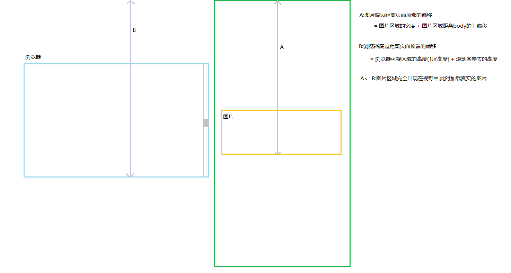

## 图片懒加载

> 1. 前端性能优化的重要方案
>    - 通过图片或者数据的延迟加载,可以加快页面渲染的速度,让第一次打开页面的速度变快
>    - 只有滑动到某个区域,才加载真实的图片,可以节省带宽
> 2. 处理方案
>    + 把所有需要延迟加载的图片用盒子包起来,设置宽高和默认占位图
>    + 开始让所有img的src为空,把真实图片的地址放到img的自定义属性上,让img隐藏
>    + 等待所有其他资源都加载完成后,我们再开始加载图片
>    + 对于很多图片,需要当页面滚动的时候,当前图片区域完全显示出来后再加载真实图片

### 图解



### 单张图片延迟加载

```html
<style>
	* {
        margin: 0;
        padding: 0;
    }
    .img-box {
        width: 100%;
        margin: 2000px auto;
        height: 380px;
        max-height: 380px;
        overflow: hidden;
        background-color: #ddd;
    }
    img {
        display: none;
        width: 100%;
    }
</style>

<div class="img-box">
    
</div>

<!-- 引入jquery -->
<script src="node_modules/jquery/dist/jquery.min.js"></script>
<script src="js/lazyload.js"></script>
```

lazyload.js

```js
let $imgBox = $('.img-box'),
    $img = $imgBox.children('img'),
    $window = $(window);
//jquery中的事件绑定支持多事件绑定
$window.on('load scroll',function() {
    //之前加载过的,不重新加载
    if($img.attr('isLoad') === 'true') return
    let $A = $imgBox.outerHeight() + $imgBox.offset().top,
        $B = $window.outerHeight() + $window.scrollTop();
    if($A <= $B) {
        //加载真实图片
        $img.attr('src',$img.attr('data-img'))
        //加载成功
        $img.on('load',function() {
            //$img.css('display','block')
            $img.stop().fadeIn()
        })
        //attr存储的自定义属性值都是字符串格式 'true'
        $img.attr('isLoad',true)
    }
})
```

### 多张图片延迟加载

```html
<style>
	* {
        margin: 0;
        padding: 0;
    }

    .container {
        width: 100%;
        margin: 0 auto;
    }

    .container>.img-box {
        height: 380px;
        overflow: hidden;
        background-color: #ddd;
        margin-bottom: 20px;
    }
    img {
        display: none;
        width: 100%;
    }
</style>
<div class="container"></div>

<!-- 引入jquery -->
<script src="node_modules/jquery/dist/jquery.min.js"></script>
<script src="js/lazyload.js"></script>
```

lazyload.js

```js
let str = ``
let $container = $('.container'),
    $imgBoxs = null,
    $window = $(window);
//创建长度为20的数组,每一项用null填充
new Array(20).fill(null).forEach(item => {
    str += `<div class="img-box">
        
        </div>`
})
$container.html(str)
$imgBoxs = $container.children('.img-box')
//多张图片延迟加载
$window.on('load scroll',function() {
    let $B = $window.outerHeight() + $window.scrollTop()
    //循环每一个图片区域,根据当前图片距离计算图片是否加载
    $imgBoxs.each((index,item) => {
        let $item = $(item),
            $itemA = $item.outerHeight() + $item.offset().top
            isLoad = $item.attr('isLoad')
        if(isLoad) return
        if($itemA <= $B) {
            //attr存储的自定义属性值都是字符串格式 'true'
            $img.attr('isLoad',true)
            //加载当前区域中的图片
            console.log($item)
            let $img = $item.children('img')
            $img.attr('src',$img.attr('data-img'))
            //加载成功
            $img.on('load',() => $img.stop().fadeIn())
        }
    })
})
```

