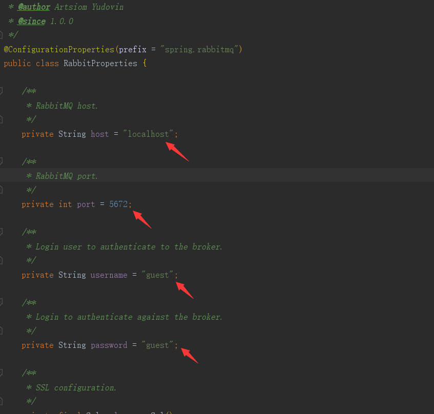
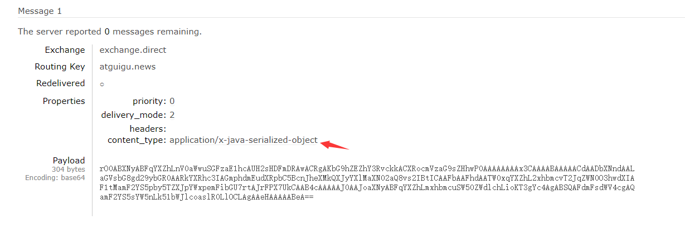
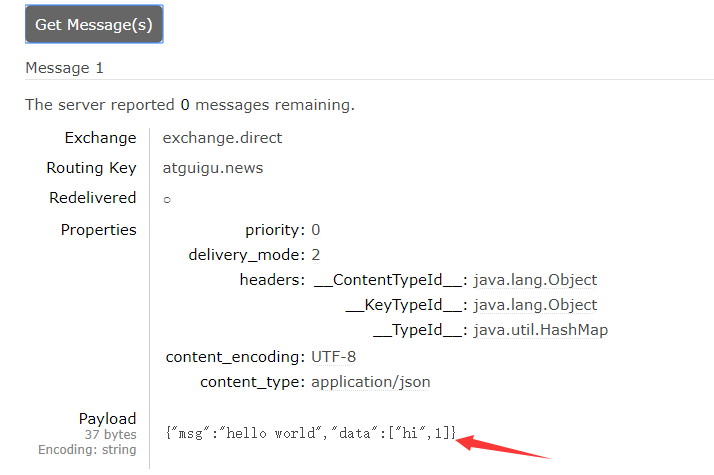
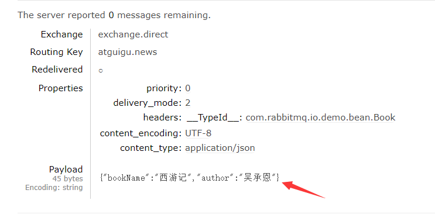
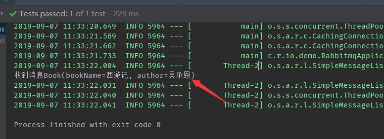
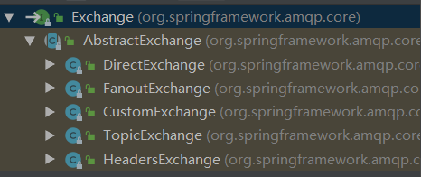
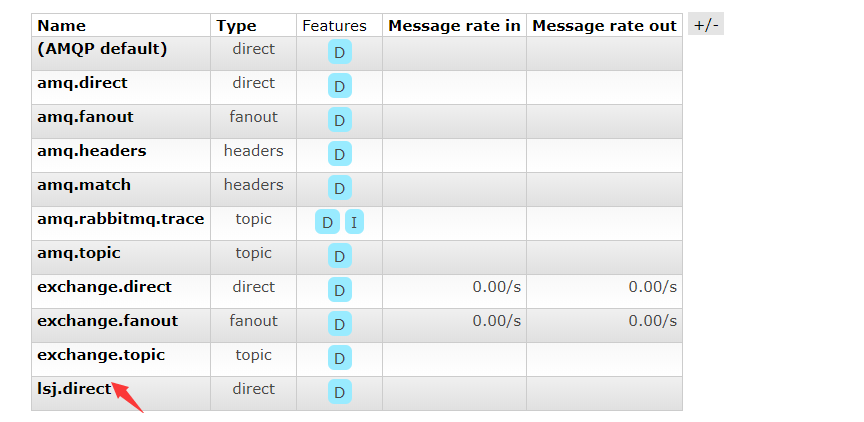
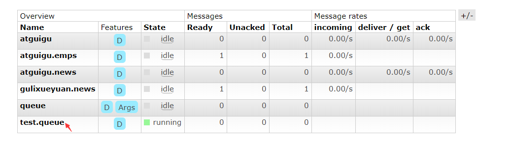

## docker启动rabbitMQ
```
-- 安装rabbitMQ带后台管理界面(带management),推荐使用daocloud加速,速度特别快
$ docker pull rabbitmq:management-alpine
-- docker后台运行(5672:服务器与客户端交互端口,15672:web管理界面端口)
$ docker run -d -p 5672:5672 -p 15672:15672 --name myrabbitmq IMAGE_ID
-- 进入rabbitmq后台(name:guest;password:guest)
127.0.0.1:15672 
```

## 导入maven依赖
```xml
<dependency>
            <groupId>org.springframework.boot</groupId>
            <artifactId>spring-boot-starter-amqp</artifactId>
</dependency>
```

## 项目Demo

### 消息发送
> RabbitProperties:封装了RabbitMQ的配置
RabbitTemplate:给RabbitMQ发送和接收消息
AmqpAdmin:RabbitMQ系统管理功能组建


```java
	@Autowired
    RabbitTemplate rabbitTemplate;
/**
     * 1.单播模式(点对点):direct
     */
    @Test
    public void contextLoads() {
        //Message需要自己构造一个;定义消息体内容和消息头
        //rabbitTemplate.send(exchange,routingKey,message);

        Map<String,Object> map = new HashMap<>();
        map.put("msg","hello world");
        map.put("data", Arrays.asList("hi",1));
        //对象被默认序列化后发送出去(广播模式可以陆由键为"")
        rabbitTemplate.convertAndSend("exchange.direct","atguigu.news",map);
    }
    
    /**
     * 接收消息
     */
    @Test
    public void receive() {
    	//填写消息队列名称
        Object obj = rabbitTemplate.receiveAndConvert("atguigu.news");
        System.out.println(obj);//{msg=hello world, data=[hi, 1]}
    }
```
默认序列化使用<code>application/x-java-serialized-object</code>


> 如何将消息转化为json?
```java
@Configuration
public class MyAmqpConfig {

    /**
     * 消息序列化为json
     * @return
     */
    @Bean
    public MessageConverter messageConverter() {
        return new Jackson2JsonMessageConverter();
    }
}
```


> rabbitmq发送对象
```java

	@Autowired
    RabbitTemplate rabbitTemplate;
/**
     * 1.单播模式(点对点):direct
     */
    @Test
    public void contextLoads() {
        //Message需要自己构造一个;定义消息体内容和消息头
        //rabbitTemplate.send(exchange,routingKey,message);

        Map<String,Object> map = new HashMap<>();
        map.put("msg","hello world");
        map.put("data", Arrays.asList("hi",1));
        //对象被默认序列化后发送出去
        rabbitTemplate.convertAndSend("exchange.direct","atguigu.news",new Book("西游记","吴承恩"));
    }
```


### 进行消息监听
```java

/**消息监听启动需要在application启动类上添加@EnableRabbit注解*/
@Service
public class BookService {

	//监听队列
    @RabbitListener(queues = "atguigu.news")
    public void receive(Book book) {
        System.out.println("收到消息"+book);
    }
}
```


### 创建交换器
```
@Autowired
    AmqpAdmin amqpAdmin;

    /**
     * 创建交换器
     */
    @Test
    public void createExchange() {
        //创建交换器
        amqpAdmin.declareExchange(new DirectExchange("lsj.direct"));
        //创建队列
        amqpAdmin.declareQueue(new Queue("test.queue"));
        //创建绑定规则
        amqpAdmin.declareBinding(new Binding("test.queue",
                Binding.DestinationType.QUEUE,"lsj.direct","hh",null));
        System.out.println("创建完成");
    }
```





