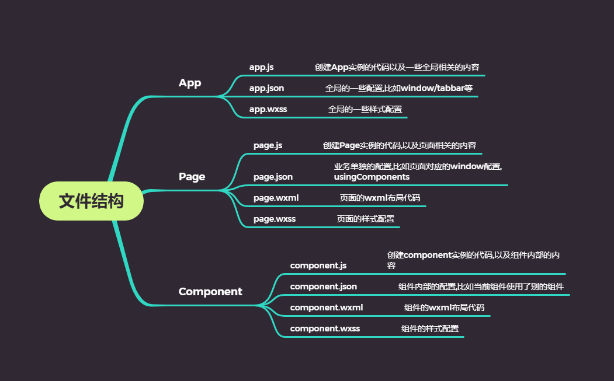
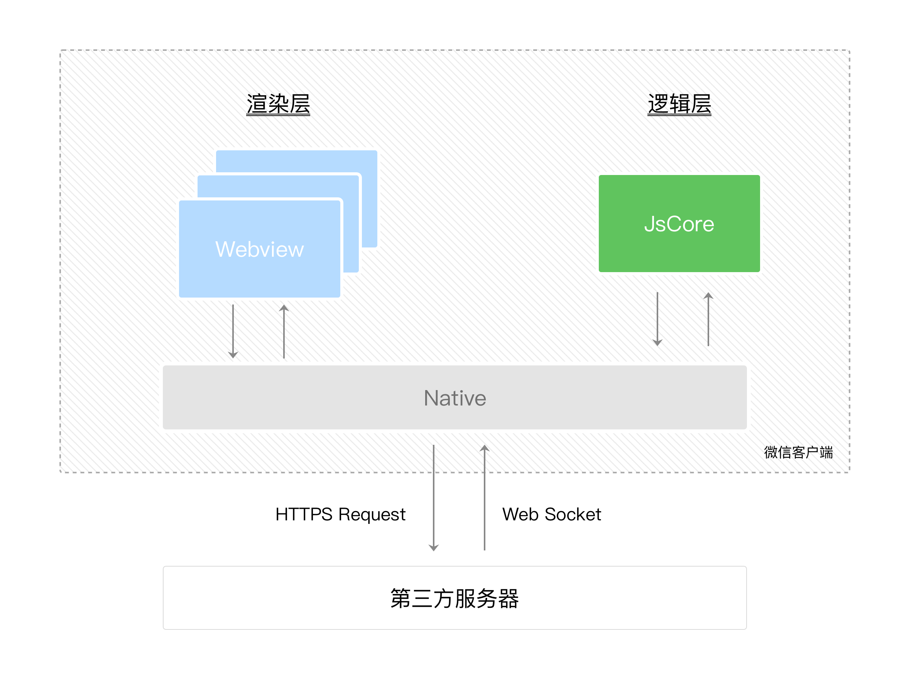
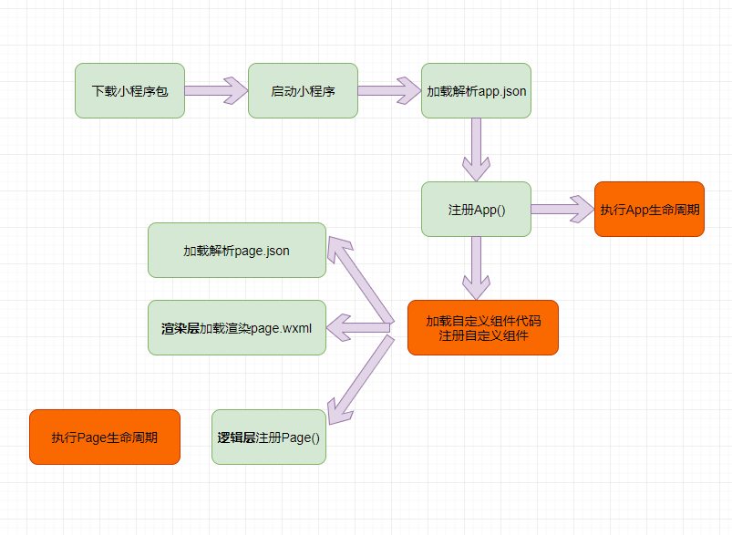

> 开发前期准备工作不描述(申请appid,下载开发工具...)

## 小程序基础

### 小程序开发主要部分

- 页面布局: wxml => 类似html
- 页面样式: wxss => 类似css(部分支持,部分增强)
- 页面脚本: js+wxss 

- 目录结构

  - ```
    project
    ├── pages
    |   ├── index
    |   |   ├── index.json  index 页面配置
    |   |   ├── index.js    index 页面逻辑
    |   |   ├── index.wxml  index 页面结构
    |   |   └── index.wxss  index 页面样式表
    |   └── log
    |       ├── log.json    log 页面配置
    |       ├── log.wxml    log 页面逻辑
    |       ├── log.js      log 页面结构
    |       └── log.wxss    log 页面样式表
    ├── app.js              小程序逻辑
    ├── app.json            小程序公共设置
    └── app.wxss            小程序公共样式表
    ```

### 文件结构



### 小程序常见配置文件

- project.config.json: 项目配置文件,如项目名称,appid
- sitemap.json: 站点地图
- app.json: 全局配置
- page.json: 页面配置

### 小程序的双线程模型

- 谁是小程序的宿主环境? => 微信客户端
- 宿主环境为了执行小程序的各种文件:wxml,wxss.js文件,提供了小程序的双线程模型
- 渲染层 => 执行wxml,wxss(一个程序有多个页面,会使用多个Webview线程) | 逻辑层 => 执行js  | native(微信客户端)



- 界面渲染整体流程
  - 在渲染层,宿主环境把WXML转化为对应的JS对象
  - 将JS对象再次转换为真实DOM树,交由渲染层线程渲染
  - 数据变化时,逻辑层提供最新的变化数据,JS对象发生变化比较进行diff算法对比
  - 将最新变化的内容反映到真实的DOM树，更新UI

### 小程序启动流程



### 快捷键

```
// 代码格式化
alt+shift+f
// 真机调试(会自动同步)
ctrl+shift+p
```


### 注册App常规使用

- 判断小程序的进入场景
- 监听生命周期函数,在生命周期中执行对应的业务逻辑,比如在某个生命周期函数中获取微信用户的信息
- 因为App()实例只能有一个,并且时全局共享的(单例对象),所以可以放入共享数据


### Page生命周期


### 自适应单位

> 微信小程序规定,可以根据屏幕宽度进行自适应。规定屏幕宽为750rpx。如在 iPhone6 上，屏幕宽度为375px，共有750个物理像素，则750rpx = 375px = 750物理像素，1rpx = 0.5px = 1物理像素。

## 功能开发

> 推荐直接参考官方文档
>
> api接口:
>
> 1. http://123.207.32.32:8000/api/v2
>
> 2. http://106.54.54.237:8000/api/v1

### 获取用户信息/场景值

```js
onLaunch: function (options) {
    // 异步调用=>获取用户信息(即将废弃)
    wx.getUserInfo({
        success: function(res) {
            const { avatarUrl, nickName } = res.userInfo
            console.log(avatarUrl, nickName)
        }
    })
    // 获取小程序场景值等=>两者都可以
    console.log(wx.getLaunchOptionsSync())
    console.log(options)
},
    
// 推荐写法=>绑定事件获取event信息
<button size="mini" bindgetuserinfo="getInfo" open-type="getUserInfo">获取授权</button>
<!-- 展示用户信息,更多查看官方文档 --> 
<open-data type="userNickName"></open-data>
<open-data type="userAvatarUrl"></open-data>
```


#### wxml的导入方式

- import导入
  - 主要是导入模板
  - 不能递归导入
- include引入
  - 将公共的wxml组件抽取到一个文件中
  - 不能导入template/wxs,可以进行递归导入


### wxs

#### 相关限制

	- wxs的运行环境和其他的javascript代码是隔离的,wxs不能调用其他javascript文件中定义的函数,也不能调用小程序提供的API
	- wxs不能作为组件的事件回调

### 常见组件

- text组件=>类似span,行内元素
- view组件=>类似div,块级元素

### 请求封装(简化版)

```js
const request = ({ url, method = 'get', data = {}}) => {
  return new Promise((resolve,reject) => {
    wx.request({
      url: url,
      method: method,
      data: data,
      success: resolve,
      fail: reject
    })
  })
}
export { request }

request({ url: 'http://123.207.32.32:8000/api/v2/recommend'})
    .then(res => console.log(res))
	.catch(err => err)
```

### 用户登录


## 组件化开发

### 组件的样式细节

- 组件内样式对外部样式的影响
  - 组件内的class样式,只对组件wxml内的节点生效,对于引用组件的Page页面不生效
  - 组件内不能使用id选择器,属性选择器,标签选择器
- 外部样式对组件内样式的影响
  - 外部使用class的样式,只对外部wxml的class生效,对组件内是不生效的
  - 外部使用了id选择器,属性选择器不会对组件内产生影响
  - 外部使用了标签选择器,会对组件内产生影响
- 整体结论
  - 组件内的class样式于组件外的class样式,默认是隔离的
  - 为了防止样式的错乱,官方不推荐使用Id,属性,标签选择器

### classs实现样式的互相影响

- 在Component对象中,传入options属性 => 其中有stylelsolation(隔离属性)

### 组件间通信

- 父组件->子组件

```
// 父组件wxml
<mycom title="组件1"></mycom>
<mycom title="组件2"></mycom>

// 子组件js
Component({
  properties: {
    //title: String,
    title: {
      type: String,
      value: '默认标题',
      observer: (newVal,oldVal) => console.log(newVal,oldVal)
    }
  }
})

// 子组件wxml
<view>{{title}}</view>
```


### git操作

```
1. 打tag
git tag xxx
2. 查看log
git log
3. 版本回退
git reset --hard xxx(git log查询的一串字符)
4. 本地修复操作
git reflog // 显示所有的操作记录，包括提交，回退的操作
5. 推送tag到远程
git push origin branch-name tag-name
6. 删除远程分支
git push origin --delete branch-name
7. 删除没有track文件
git clean -df
```

## 语法

### Mustache语法

#### WXML基本格式

- 类似于html代码
- 必须有严格的闭合(单标签也需要闭合)
- 大小写敏感

- div=>view;span=>text

---

[小程序官网](https://mp.weixin.qq.com/)

[入口文件配置](https://developers.weixin.qq.com/miniprogram/dev/framework/structure.html)

[小程序打开场景](https://developers.weixin.qq.com/miniprogram/dev/reference/scene-list.html)

[httpbin各类网络请求模拟](http://httpbin.org/)