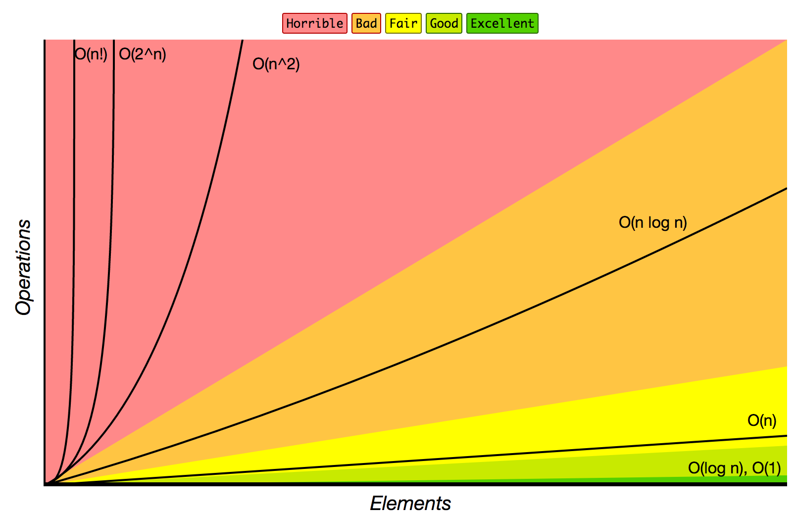
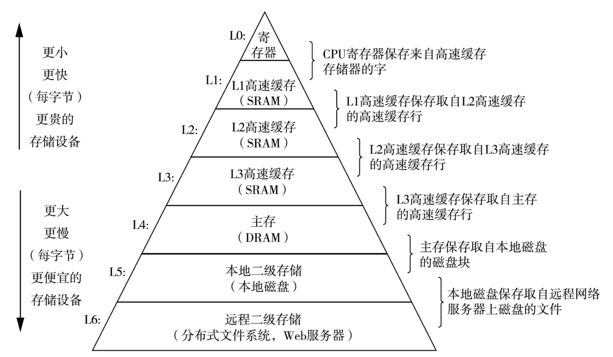
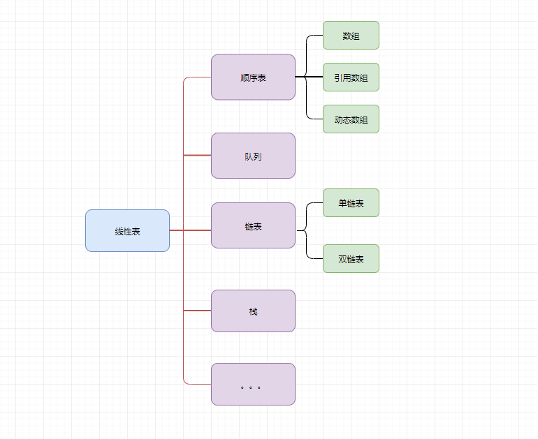
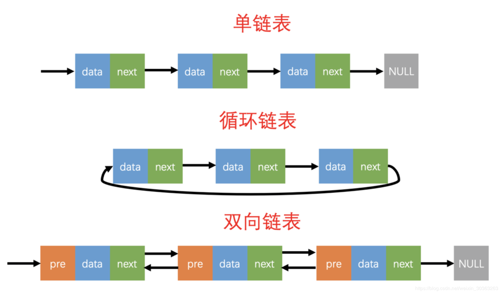

> 对算法基础知识进行一个简单记录

#### 大O表示法

>  将算法执行运算的操作数丢弃掉低阶项,再去掉所有的系数,在它前面加上一个O

#### 时间复杂度

	- 更倾向于趋于无穷的时间复杂度优劣
	
	- 高阶项才是函数增长的主要影响因素

- 越靠近左,算法速度越快
  - **O(1)  < O(lgn)  <  O(n) <  O(nlgn)  < O(n<sup>2</sup>)< O(n<sup>3</sup>)<O(2<sup>n</sup>)  < O(n!) < O(n<sup>n</sup>)**
  - 基于规模n 各级别算法 与 复杂度 的关系如下：



##### 时间复杂度计算的一般法则

- 法则1 - for循环

  ```python
  n = 1000
  k = 0
  for a in range(n): # n次
      k += 1 # O(1)
  ```

  > 时间复杂度: O(n x 1) => O(n)

- 法则2 - 嵌套的for循环

  ```python
  n = 1000
  m = 200
  k = 0
  for a in range(n): # n次
      for b in range(m): # m次
          k += 1 # O(1)
  ```

  >时间复杂度:O(m x n x 1) => O(m x n)

- 法则3 - 顺序语句

  ```python
  n = 1000
  k = 0
  
  # 第一部分时间复杂度为O(n)
  for a in range(n):
      k += 1
  
  # 第二部分时间复杂度为O(n^2)
  for a in range(n):
      for b in range(n):
          k += 1
  ```

  >时间复杂度为 O(n + n<sup>2</sup>) => O(n<sup>2</sup>)

- 法则4 - if/else分支语句

  ```python
  n = 1000
  k = 0
  flag = 1
  
  ## 第一部分时间复杂度为O(n)
  if flag >= 0:
      for a in range(n):
          k += 1
          
  ## 第二部分时间复杂度为O(n^2)
  else:
      for a in range(n):
          for b in range(n):
              k += 1
  ```

  > 时间复杂度为O(n<sup>2</sup>) -- 关注最差情况的时间复杂度

#### 二分法

> 二分法就是一种在<code>有序数组</code>种查找某一特定元素的搜索算法
>
> 搜索过程从数组的中间元素开始:
>
> - 如果中间元素正好是要查找的元素,则搜索过程结束
> - 如果某一定元素大于或者小于中间元素,则在数组种大于或小于中间元素的那一半种查找,而且跟开始一样从中间元素开始比较
> - 如果在某一步骤数组为空,则代表找不到

- 线性检索和二分检索求 1 的位置

   

```javascript
function binary_search(arr,key) {
    let start = 0
    let end = arr.length-1
    while( start <= end) {
        let mid = Math.round((start + end) / 2)
        if(arr[mid] < key) {
            start = mid + 1
        } else if(arr[mid] > key) {
            end = mid - 1
        } else {
            return mid
        }
    }
    return -1
}
```

---

#### 数组与链表事件复杂度

| 操作            | 链表 | 数组 |
| --------------- | ---- | ---- |
| 查找            | O(n) | O(1) |
| 在头部插入/删除 | O(1) | O(n) |
| 在尾部插入/删除 | O(n) | O(1) |
| 在中间插入/删除 | O(n) | O(n) |



> 插入删除很少,查询非常多,又不会out of memory,采用数组。如果是频繁的插入,遍历,查询检索很少,就才用链表

---

#### 线性表->顺序表->数组



#### 链表



