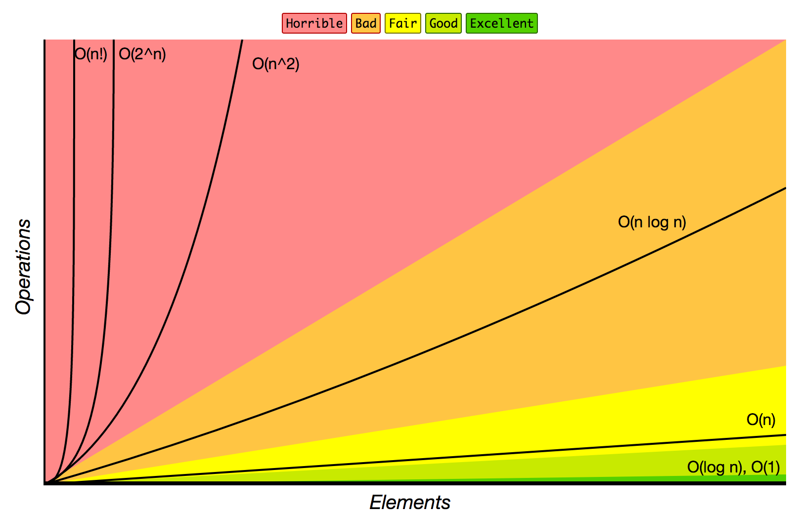
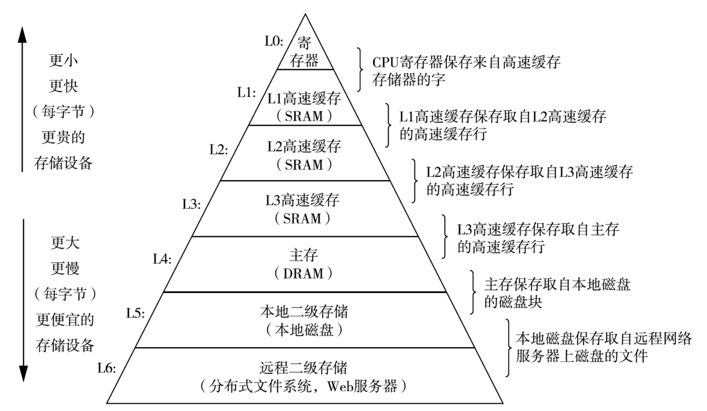
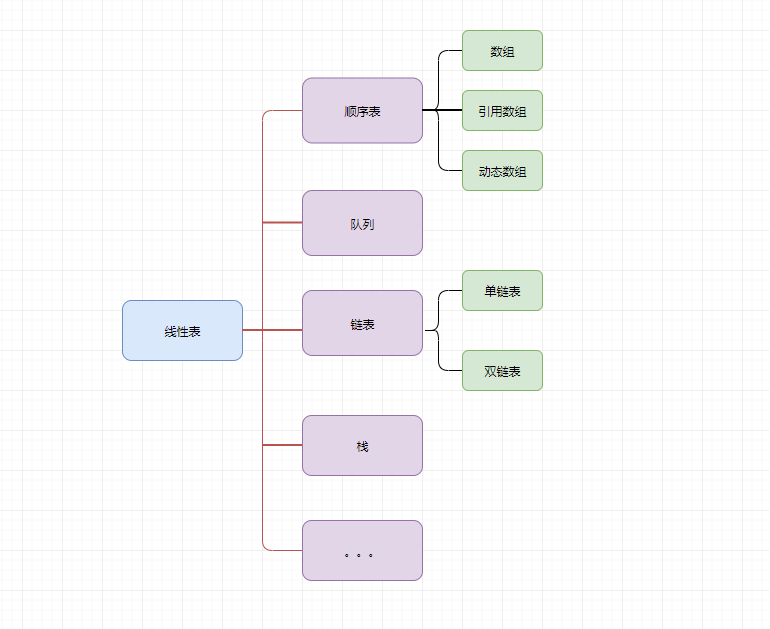
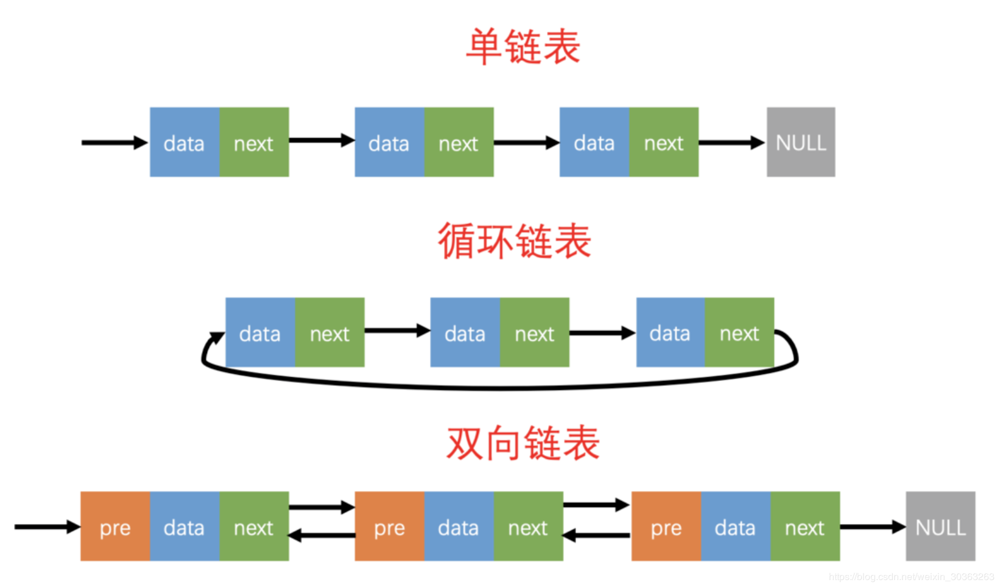

> 对算法基础知识进行一个简单学习(非本专业没有系统学习过),只有补下数据结构与算法了

#### 大O表示法

>  将算法执行运算的操作数丢弃掉低阶项,再去掉所有的系数,在它前面加上一个O

#### 时间复杂度

	- 更倾向于趋于无穷的时间复杂度优劣
	
	- 高阶项才是函数增长的主要影响因素

- 越靠近左,算法速度越快
  - **O(1)  < O(lgn)  <  O(n) <  O(nlgn)  < O(n<sup>2</sup>)< O(n<sup>3</sup>)<O(2<sup>n</sup>)  < O(n!) < O(n<sup>n</sup>)**
  - 基于规模n 各级别算法 与 复杂度 的关系如下：



##### 时间复杂度计算的一般法则

- 法则1 - for循环

  ```python
  n = 1000
  k = 0
  for a in range(n): # n次
      k += 1 # O(1)
  ```

  > 时间复杂度: O(n x 1) => O(n)

- 法则2 - 嵌套的for循环

  ```python
  n = 1000
  m = 200
  k = 0
  for a in range(n): # n次
      for b in range(m): # m次
          k += 1 # O(1)
  ```

  >时间复杂度:O(m x n x 1) => O(m x n)

- 法则3 - 顺序语句

  ```python
  n = 1000
  k = 0
  
  # 第一部分时间复杂度为O(n)
  for a in range(n):
      k += 1
  
  # 第二部分时间复杂度为O(n^2)
  for a in range(n):
      for b in range(n):
          k += 1
  ```

  >时间复杂度为 O(n + n<sup>2</sup>) => O(n<sup>2</sup>)

- 法则4 - if/else分支语句

  ```python
  n = 1000
  k = 0
  flag = 1
  
  ## 第一部分时间复杂度为O(n)
  if flag >= 0:
      for a in range(n):
          k += 1
          
  ## 第二部分时间复杂度为O(n^2)
  else:
      for a in range(n):
          for b in range(n):
              k += 1
  ```

  > 时间复杂度为O(n<sup>2</sup>) -- 关注最差情况的时间复杂度

#### 二分法

> 二分法就是一种在<code>有序数组</code>种查找某一特定元素的搜索算法
>
> 搜索过程从数组的中间元素开始:
>
> - 如果中间元素正好是要查找的元素,则搜索过程结束
> - 如果某一定元素大于或者小于中间元素,则在数组种大于或小于中间元素的那一半种查找,而且跟开始一样从中间元素开始比较
> - 如果在某一步骤数组为空,则代表找不到

- 线性检索和二分检索求 1 的位置

   

```javascript
function binary_search(arr,key) {
    let start = 0
    let end = arr.length-1
    while( start <= end) {
        let mid = Math.round((start + end) / 2)
        if(arr[mid] < key) {
            start = mid + 1
        } else if(arr[mid] > key) {
            end = mid - 1
        } else {
            return mid
        }
    }
    return -1
}
```

---

#### 数组与链表事件复杂度

| 操作            | 链表 | 数组 |
| --------------- | ---- | ---- |
| 查找            | O(n) | O(1) |
| 在头部插入/删除 | O(1) | O(n) |
| 在尾部插入/删除 | O(n) | O(1) |
| 在中间插入/删除 | O(n) | O(n) |



> 插入删除很少,查询非常多,又不会out of memory,采用数组。如果是频繁的插入,遍历,查询检索很少,就才用链表

---

#### 线性表->顺序表->数组



#### 链表



#### 排序算法

##### 冒泡排序

>思路分析:
>
>1. 相邻两个数两两相比，n[i]跟n[j+1]比，如果n[i]>n[j+1]，则将连个数进行交换
>
>2. j++, 重复以上步骤，第一趟结束后，最大数就会被确定在最后一位，这就是冒泡排序又称大（小）数沉底，
>
>3. i++,重复以上步骤，直到i=n-1结束，排序完成。


```js
/**
 * 冒泡排序
 * @param {Array} arr  
 */
function bubble(arr) {
    let temp = null
    for(let m = 0;m < arr.length-1;m++) {
        for(let n = 0;n < arr.length-1-m;n++) {
            if(arr[n] > arr[n+1]) {
                temp =  arr[n]
                arr[n] = arr[n+1]
                arr[n+1] = temp
            }
        }
    }
}
bubble([1,2,5,3,9,7]) //[1,2,3,5,7,9]
```

##### 插入排序

>思路
>
>- 从第一个元素开始，该元素可以认为已经被排序；
>- 取出下一个元素，在已经排序的元素序列中从后向前扫描；
>- 如果该元素（已排序）大于新元素，将该元素移到下一位置；
>- 重复步骤3，直到找到已排序的元素小于或者等于新元素的位置；
>- 将新元素插入到该位置后；
>- 重复步骤2~5。


```js
/**
 * 插入排序
 * @param {Array}} arr 
 */
function insert(arr) {
    let handle = []
    handle.push(arr[0])
    for(let i = 1;i < arr.length;i++) {
        let a = arr[i]
        for(let j = handle.length-1;j >= 0;j--) {
            let b = handle[j]
            if(a > b) {
                handle.splice(j+1,0,a)
                break
            }
            if(j == 0) {
                handle.unshift(a)
            }
        }
    }
}
insert.call(null,[1,2,5,3,9,7]) //[1, 2, 3, 5, 7, 9]
```

##### 快速排序


```js
function quick(arr) {
    //4.结束递归
    if(arr.length <= 1) {
        return arr
    } 
    //1.找到数组的中间项,在原有的数组中把它溢出
    let middleIndex = Math.floor(arr.length/2)
    let middleVal = arr.splice(middleIndex,1)[0]
    //2.准备左右两个数组,循环剩余数组的每一项,比当前项小的放左边,反之放右边
    let arrLeft = [],
        arrRight = [];
    for(let i = 0;i < arr.length;i++) {
        let item = arr[i]
        item < middleVal ? arrLeft.push(item) : arrRight.push(item)

    }
    //3.递归让左右两边的数组持续处理,直到左右两边都排好序为止
    return quick(arrLeft).concat(middleVal,quick(arrRight))
}
console.log(quick.call(null,[1,3,2,7,6,5,11,0]))
```


#### 递归算法

> 使用递归注意递归的内存消耗问题
>
> 衍生出的算法不做描述,例如递归求和衍生求积问题


- 求和问题

> 求0到传入参数总和,不探讨数据类型等判定

```js
function count(num) {
    if(num == 0) {
        return num
    }
    return num + count(num-1)
}
count.call(null,10) //55
```

